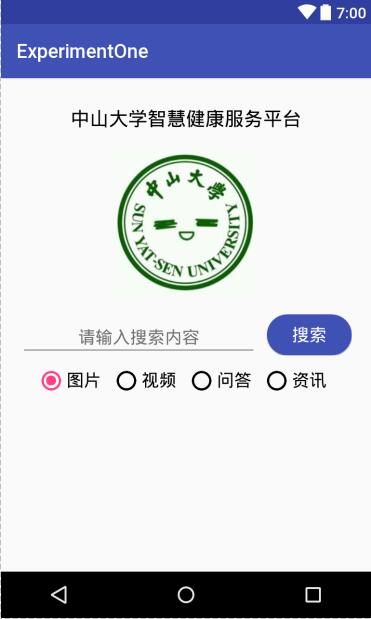

# 中山大学数据科学与计算机学院本科生实验报告
## （2018年秋季学期）
| 课程名称 |  手机平台应用开发   |  任课老师  |        郑贵锋        |
| :--: | :---------: | :----: | :---------------: |
|  年级  |    2016级    | 专业（方向） |       数字媒体        |
|  学号  |  16340294   |   姓名   |        张星         |
|  电话  | 15989001410 | Email  | 1401046908@qq.com |
| 开始日期 | 2018.09.27  |  完成日期  |    2018.09.29     |

---

## 一、实验题目

#### 基本的UI设计

## 二、实验目的

1. 熟悉Android Studio开发工具操作。
2. 熟悉Android Studio基本UI开发，并进行UI基本设计。

---

## 三、实现内容

实现一个Android应用，界面呈现如图中的效果。



#### 要求

- 该界面为应用启动后看到的第一个界面。
- 各控件的要求
  * 标题字体大小**20sp**，与顶部距离**20dp**，居中；
  * 图片与上下控件的间距均为**20dp**，居中；
  * 输入框整体距左右屏幕各间距**20dp**，内容（包括提示内容）如图所示，内容字体大小**18sp**；
  * 按钮与输入框间距**10dp**，文字大小**18sp**。按钮背景框左右边框与文字间距**10dp**，上下边框与文字间距**5dp**，圆角半径**180dp**，背景色为**#3F51B5**；
  * 四个单选按钮整体居中，与输入框间距10dp，字体大小**18sp**，各个单选按钮之间间距**10dp**，默认选中的按钮为第一个。

#### 使用的组件

TextView、EditText、ConstraintLayout、Button、ImageView、RadioGroup、RadioButton。

---

## 四、课后实验结果
### (1)实验截图

#### 如图：


### (2)实验步骤以及关键代码

​          首先，需要思考如何布局。按照题目要求，中间的搜索框与按钮应该是同一个父元素的两个子元素，所以我将它们放入了同一个layout，然后在其中布局。其余部分，就按照从上到下的方式，一一布局即可。至于最下面的单选框，则需要将其放入通过个group里，然后在group属性中指定选中第一个即可。

* 最上面的文字框，选用TextView

  ```xml
  android:text="@string/platform"
  android:textColor="#111"
  android:textSize="20sp"
  ```

* 图片，将其放入drawable文件夹中，加以引用

  ```xml
  android:layout_marginTop="20dp"
  android:src="@drawable/sysu"
  android:contentDescription="SmartHealth"
  ```

* 搜索框与按钮，将其放入了一个layout中

  ```xml
  <android.support.constraint.ConstraintLayout xmlns:android="http://schemas.android.com/apk/res/android"
  xmlns:app="http://schemas.android.com/apk/res-auto"
  xmlns:tools="http://schemas.android.com/tools"
  android:id="@+id/layout1"
  android:layout_width="match_parent"
  android:layout_height="wrap_content"
  android:layout_marginLeft="20dp"
  android:layout_marginRight="20dp"
  android:layout_marginTop="20dp"
  app:layout_constraintLeft_toLeftOf="parent"
  app:layout_constraintRight_toRightOf="parent"
  app:layout_constraintTop_toBottomOf="@id/view2">
  ```

  其中指出了width是match_parent，这样就能占满整个屏幕的宽度，然后之后指定margin，为中间的搜索框与按钮留好空间。

  搜索框：

  ```xml
  android:layout_width="0dp"
  android:layout_height="wrap_content"
  android:gravity="center"
  app:layout_constraintLeft_toLeftOf="parent"
  app:layout_constraintRight_toLeftOf="@id/button"
  ```

  width设置为0dp，这样就可以使其自动占据父元素剩余空间。

  ```xml
  android:layout_width="wrap_content"
  android:layout_height="wrap_content"
  android:layout_marginLeft="10dp"
  android:layout_marginStart="10dp"
  android:background="@drawable/button"
  ```

  width与height选择自适应，根据内容决定大小，使其靠向父元素的右边缘。

* 单选按钮，使用 _GroupRadio_

  ```xml
  android:orientation="horizontal"
  android:checkedButton="@id/rbt1"
  ```

  设置排列方式为水平排列，默认选择button1.

### (3)实验遇到的困难以及解决思路

​        开始写代码的时候，无法预览xml，就在网上查找解决办法：只需在style.xml中，sytle标签中AppTheme后面的parent最前面添加 _Base_ 即可：

```xml
<style name="AppTheme"    parent="Base.Theme.AppCompat.Light.DarkActionBar">
```

​        之后由于实验要求中提到，搜索框和按钮要“整体”距离边框，所以我将这两个元素放入了同一个父元素layout中，但是当搜索框width选择 _wrap_parent_ 时，宽度取决于内容的自适应，无法达到实验要求的宽度。通过在网上查找资料，我将宽度属性设置为0dp，这样就能根据父元素和兄弟元素的大小，自动适应剩余宽度，这样就能达到效果。同时这种设置方法，也可以指定各个兄弟元素占父元素的比例宽度，十分好用。

---

## 五、实验思考及感想

​        之前没有接触过XML，但是学过HTML，这种脚本写起来还是挺类似的。布局方面，constraintLayout确实挺好用的，但还是要熟悉下各种属性，以求达到更好效果。项目中，最好将各种常量写入values中，这样既方便，又美观。同时，对于Git命令也要更加熟悉，本次项目中，就因为Git的问题，重做了好几次。