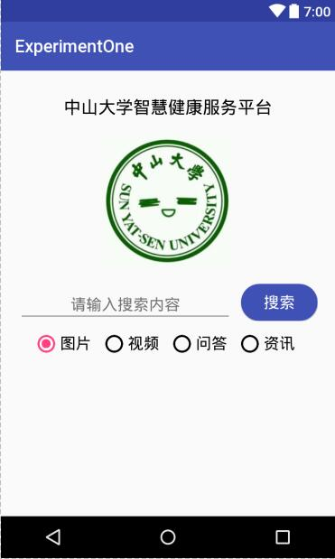
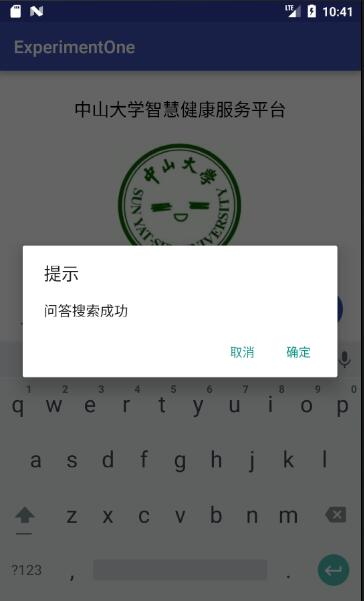
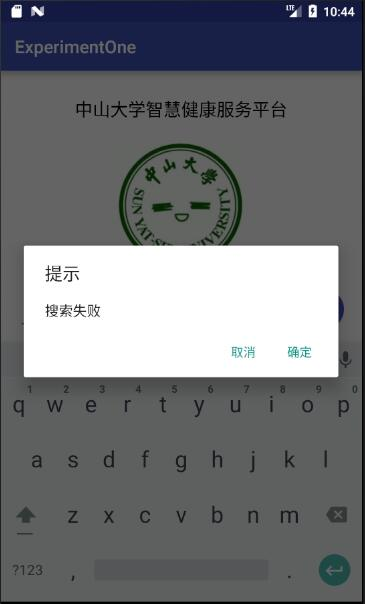
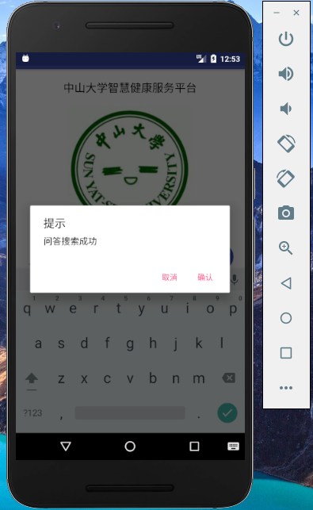
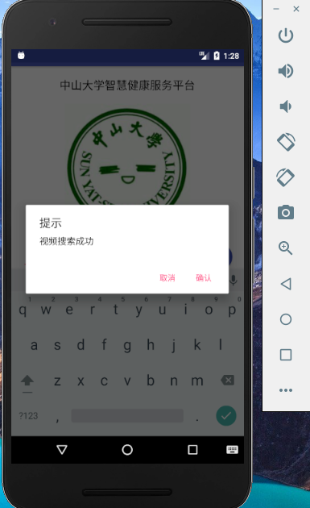
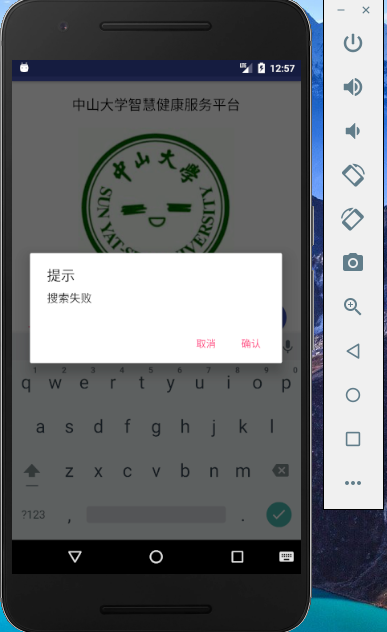

# 中山大学数据科学与计算机学院本科生实验报告
## （2018年秋季学期）
| 课程名称 |  手机平台应用开发   |  任课老师  |        郑贵锋        |
| :--: | :---------: | :----: | :---------------: |
|  年级  |    2016级    | 专业（方向） |       数字媒体        |
|  学号  |  16340294   |   姓名   |        张星         |
|  电话  | 15989001410 | Email  | 1401046908@qq.com |
| 开始日期 | 2018.10.01  |  完成日期  |    2018.10.03     |

---

## 一、实验题目

#### 基础的事件处理

---

## 二、实验目的

1. 了解Android编程基础。
2. 熟悉Button、RadioButton、EditText等基本控件，能够处理这些控件的基本事件。
3. 学会弹出对话框，并定制对话框中的内容，能对确定和取消按钮的事件做处理。

---

## 三、实现内容

实现一个Android应用，界面呈现如图中的效果。



#### 要求

- 该界面为应用启动后看到的第一个界面。

- 各控件的要求

  * 点击搜索按钮：

    * 如果搜索内容为空，弹出Toast信息“**搜索内容不能为空**”。

    * 如果搜索内容为“Health”，根据选中的RadioButton项弹出如下对话框。

      

      点击“确定”，弹出Toast信息——**对话框“确定”按钮被点击**。
      点击“取消”，弹出Toast 信息——**对话框“取消”按钮被点击**。
      否则弹出如下对话框，对话框点击效果同上。

      

    * RadioButton选择项切换：选择项切换之后，弹出Toast信息“**XX被选中**”，例如从图片切换到视频，弹出Toast信息“**视频被选中**”

---

## 三、课后实验结果
### (1)实验截图

1. 输入内容为空：

   

2. 搜索内容为“Health”：

   * 选中”问答“：

     

   * 选中”视频“：

     

3. 点击”确定“：

   

4. 点击”取消“：

   

5. 搜索失败：

   

6. 切换RadioButton：

   

### (2)实验步骤以及关键代码

​          按照老师上课所讲，可以在xml中指定函数，也可以直接在java文件中编写，我选择第二种。通过R.id来找到相应元素，然后再绑定相应的onClick函数，即可完成。

* 搜索框，先得到EditText内容，根据其中内容做选择即可：若为空，则弹出Toast

  ```java
  EditText editText = (EditText)findViewById(R.id.text);
  if(editText.getText().toString().equals("")){
    Toast.makeText(getApplication(),"搜索内容不能为空",Toast.LENGTH_SHORT).show();
  }
  ```
  否则，根据内容做选择：若输入内容为“Health“，则弹出选中的radioButton内容+”搜索成功“，否则弹出”搜索失败“，点击确定或取消按钮则弹出对应Toast。

  ```java
  final AlertDialog.Builder alertDialog = new AlertDialog.Builder(MainActivity.this);
  alertDialog.setTitle("提示");
  if(editText.getText().toString().equals("Health")){
    alertDialog.setMessage(radioMsg+"搜索成功");
  } else{
    alertDialog.setMessage("搜索失败");
  }
  alertDialog.setPositiveButton("确认",new DialogInterface.OnClickListener() {
    @Override
    public void onClick(DialogInterface dialog, int which) {
      Toast.makeText(getApplication(),"对话框“确定”按钮被点击",Toast.LENGTH_SHORT).show();
    }
  }).setNegativeButton("取消",new DialogInterface.OnClickListener() {
    @Override
    public void onClick(DialogInterface dialog, int which) {
      Toast.makeText(getApplication(),"对话框“取消”按钮被点击",Toast.LENGTH_SHORT).show();
    }
  });
  alertDialog.show();
  ```

* RadioButton的切换，调用 _setOnCheckedChangeListener_ 函数，根据切换后Button的id来决定Toast内容：

  ```java
  RadioGroup radioGroup = (RadioGroup)findViewById(R.id.radio_group);
  radioGroup.setOnCheckedChangeListener(new RadioGroup.OnCheckedChangeListener() {
    @Override
    public void onCheckedChanged(RadioGroup group, int checkedId) {
      String message = null;
      if(checkedId==R.id.rbt1){
        message = "图片";
      }
      ...
        Toast.makeText(getApplication(),message+"被选中",Toast.LENGTH_SHORT).show();
    }
  });
  ```

### (3)实验遇到的困难以及解决思路

​        写搜索框的Dialog时，总是不能弹出，一开始检查，发现是getText后不应该直接用equal函数跟Health比较，应该先调用toString再比较。这样之后，还是不能弹出，在StackOverflow上查了之后，发现是Dialog最后没有调用以下方法：

```java
alertDialog.show();
```

之后就可以正常显示了。

​       RadioButton也有类似的问题，一开始选用了另一个函数，也是不能正常显示，换了函数就可以了。

---

## 四、实验思考及感想

​        在java文件中直接写还是要比xml+java方便且易修改的，我在设置RadioGroup的监听器时，就找不到如何在xml添加函数属性，所以直接在java文件里设置不仅实现了分离，并且便于修改与调试。还是要学会在网上多学习，很多遇到的问题，前人早已遇到并且解决，所以遇到问题还是要多找，多查，尤其是一些官方论坛和开源社区里，有很多相似的疑惑或者问题，能够给我很大启发。还有就是很多属性在官方文档里也有说明并且给出了例子，我在遇到问题时，里面也有很多详尽的说明，很有帮助。