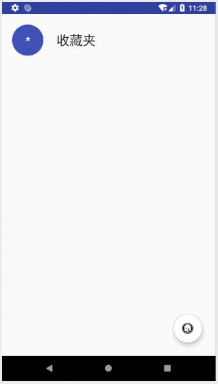

# 中山大学数据科学与计算机学院本科生实验报告
## （2018年秋季学期）
| 课程名称 |  手机平台应用开发   |  任课老师  |        郑贵锋        |
| :--: | :---------: | :----: | :---------------: |
|  年级  |    2016级    | 专业（方向） |       数字媒体        |
|  学号  |  16340294   |   姓名   |        张星         |
|  电话  | 15989001410 | Email  | 1401046908@qq.com |
| 开始日期 | 2018.10.11  |  完成日期  |    2018.10.14     |

---

## 一、实验题目

#### Intent、Bundle的使用以及RecyclerView、ListView的应用

## 二、实验目的

1. 复习事件处理。
2. 学习Intent、Bundle在Activity跳转中的应用。
3. 学习RecyclerView、ListView以及各类适配器的用法。
4. 学习FloatingActionBar的用法。

---

## 三、实现内容

本次实验模拟实现一个健康食品列表，有两个界面，第一个界面用于呈现食品列表 如下所示


数据在"manual/素材"目录下给出。
点击右下方的悬浮按钮可以切换到收藏夹



上面两个列表点击任意一项后，可以看到详细的信息：


#### UI要求

- 食品列表
  每一项为一个圆圈和一个名字，圆圈和名字都是垂直居中。圆圈内的内容是该食品的种类，内容要处于圆圈的中心，颜色为白色。食品名字为黑色，圆圈颜色自定义，只需能看见圆圈内的内容即可。
- 收藏夹
  与食品列表相似
- 食品详情界面
  1. 界面顶部

     

     ​

     顶部占整个界面的1/3。每个食品详情的顶部颜色在数据中已给出。返回图标处于这块区域的左上角，食品名字处于左下角，星标处于右下角，边距可以自己设置。 **返回图标与名字左对齐，名字与星标底边对齐。** 建议用RelativeLayout实现，以熟悉RelativeLayout的使用。

  2. 界面中部
     

     ​

     使用的黑色argb编码值为#D5000000，稍微偏灰色的“富含”“蛋白质”的argb编码值为#8A000000。"更多资料"一栏上方有一条分割线，argb编码值为#1E000000。右边收藏符号的左边也有一条分割线，要求与收藏符号高度一致，垂直居中。字体大小自定。"更多资料"下方分割线高度自定。这部分所有的分割线argb编码值都是#1E000000。

  3. 界面底部
     

     使用的黑色argb编码值为#D5000000。
- 标题栏
  两个界面的标题栏都需要去掉

#### 功能要求

- 使用RecyclerView实现食品列表。点击某个食品会跳转到该食品的详情界面，呈现该食品的详细信息。长按列表中某个食品会删除该食品，并弹出Toast，提示 **"删除XX"** 。
- 点击右下方的FloatingActionButton，从食品列表切换到收藏夹或从收藏夹切换到食品列表，并且该按钮的图片作出相应改变。
- 使用ListView实现收藏夹。点击收藏夹的某个食品会跳转到食品详情界面，呈现该食品的详细信息。长按收藏夹中的某个食品会弹出对话框询问是否移出该食品，点击确定则移除该食品，点击取消则对话框消失。如长按“鸡蛋”，对话框内容如下图所示。
  
- 商品详情界面中点击返回图标会返回上一层。点击星标会切换状态，如果原本是空心星星，则会变成实心星星；原本是实心星星，则会变成空心星星。点击收藏图表则将该食品添加到收藏夹并弹出Toast提示 **"已收藏"** 。

---

## 四、课后实验结果
### (1)实验截图

#### 如下：

1. 在首页输入 "__transition__" ，跳转到购物车页面：


2. 购物车页面：


3. 收藏夹页面：


4. 详情页面：


5. 点击星标，空心变实心：


6. 点击收藏图标，收藏成功：


7. 收藏夹页面多出十字花科蔬菜：


8. 购物车页面删除十字花科蔬菜：


9. 购物车页面与收藏夹互不影响：

   

10. 在收藏夹页面长按：


### (2)实验步骤以及关键代码

​          按照要求，算上上次的页面，共有四个页面，所以我写了四个Activity类：

```
MainActivity.java
RecyclerActivity.java
ListActivity.java
DetailActivity.java
```

将所有蔬菜包装成一个类 _Food_ :

```java
public Food(){
  this.name = null;
  this.title = null;
  this.type = null;
  this.nutrition = null;
  this.color = null;
}
```

写好几个xml，按照要求进行布局，加上TA给的资料，基本就可以完成本次作业了。

* 首先是 __RecyclerView__ ，需要一个整体布局文件和一个item布局文件，以及java类。其中item布局文件可在后面的ListView中加以复用。RecyclerView的xml文件与ListView的极为类似，都是一个RecyclerView/ListView + FloatingActionButton，如下：

  ```xml
  <android.support.v7.widget.RecyclerView
          android:id="@+id/recyclerView"
          android:layout_width="match_parent"
          android:layout_height="wrap_content" />

  <android.support.design.widget.FloatingActionButton
          android:id="@+id/fab"
          android:layout_width="wrap_content"
          android:layout_height="wrap_content"
          android:layout_gravity="end|bottom"
          android:src="@drawable/collect"
          app:fabSize="normal"
          android:backgroundTint="@color/colorWhite"
          app:layout_constraintBottom_toBottomOf="parent"
          app:layout_constraintRight_toRightOf="parent"
          android:layout_marginBottom="30dp"
          android:layout_marginRight="30dp" />
  ```

  然后是item为一个Button和一个TextView，不做赘述。

  RecyclerAcitivity类有三个私有数据，分别表示购物车数据，在收藏夹页面收藏的数据：

  ```java
  private List<Food> data;
  private List<Food> collect;
  ```

  然后在 _onCreat()_ 里给data填充数据，按照TA给的方式填入Adapter中。

  然后设置每一项的点击事件监听器：

  点击函数：

  ```java
  @Override
  public void onClick(int position) {
    Intent intent = new Intent(RecyclerActivity.this, DetailActivity.class);
    intent.putExtra("detail", data.get(position));
    intent.setFlags(Intent.FLAG_ACTIVITY_REORDER_TO_FRONT);
    startActivityForResult(intent, 1);
  }
  ```

  由于Food类在创建时已经序列化，可以直接作为 _putExtra()_ 的参数，_setFlags()_ 中的参数经我查阅资料，可以实现从其他类返回购物车时，直接调用RecyclerActivity类已有的实例，而不会重新创建，这样就可以避免重复调用 _onCreat()_ 函数对数据加以初始化，避免产生重新出现某些已经在RecyclerActivity类中被删除的数据。

  长按：删除该项。

  ```java
  @Override
  public void onLongClick(final int position) {
    String str = data.get(position).getName();
    data.remove(position);
    myRecyclerViewAdapter.notifyItemRemoved(position);
    Toast.makeText(getApplication(),"删除"+str,Toast.LENGTH_SHORT).show();
  }
  ```
  FloatingActionButton的事件监听器：

  其中 _collect_ 是用于存储点击Detail后产生的收藏项，在切换页面时将其作为参数传递过去，然后ListView将其中的项添加进列表。同理， __ListActivity__ 中类似。

  ```java
  FloatingActionButton floatingActionButton = (FloatingActionButton)findViewById(R.id.fab);
  floatingActionButton.setOnClickListener(new View.OnClickListener() {
    @Override
    public void onClick(View view) {
      Intent intent = new Intent(RecyclerActivity.this, ListActivity.class);
      intent.putExtra("collect", (Serializable)collect);
      intent.setFlags(Intent.FLAG_ACTIVITY_REORDER_TO_FRONT);
      startActivityForResult(intent,1);
    }
  });
  ```

  在第二次或之后，返回RecyclerActivity页面则并不会重复创建，而是会调用 _onNewIntent()_ 函数：

  ```java
  protected void onNewIntent(Intent intent) {
    // TODO Auto-generated method stub
    super.onNewIntent(intent);
    setIntent(intent);
    initRecyclerView();
    initFloatingButton();
  }
  ```

  处理由Detail和ListActivity返回的内容，根据resultCode进行区分，等于1，为Detail页面返回数据；等于2，则为ListAcitivity返回的数据，这是为了同步两边收藏的内容，以免出现误差：

  ```java
  @Override
  protected void onActivityResult(int requestCode, int resultCode, Intent data1){
    if (resultCode == 1){
      List<Food> food = (List<Food>)data1.getSerializableExtra("food");
      if(food!=null){
        for(Food f : food){
          Food newFood = new Food();
          newFood.setName(f.getName());
          newFood.setTitle(f.getTitle());
          newFood.setType(f.getType());
          newFood.setNutrition(f.getNutrition());
          newFood.setColor(f.getColor());
          collect.add(newFood);
        }
      }
    }
    else if (resultCode==2){
      collect = (List<Food>)data1.getSerializableExtra("collect");
    }
  }
  ```

* __ListActivity__ ，很多情况都与RecyclerActivity相似，首先是根据RecyclerActivity传递的数据进行填充：

  ```java
  List<Food> food = (List<Food>)this.getIntent().getSerializableExtra("collect");
  if(food.size()==0)
    data.add(new Food("收藏夹", "*", "","",""));
  else {
    if(food.get(0).getName().equals("收藏夹")){
      ;
    }
    else{
      data.add(new Food("收藏夹", "*", "","",""));
    }
    for(Food f : food){
      Food newFood = new Food();
      newFood.setName(f.getName());
      newFood.setTitle(f.getTitle());
      newFood.setType(f.getType());
      newFood.setNutrition(f.getNutrition());
      newFood.setColor(f.getColor());
      data.add(newFood);
    }
  }
  ```

  FloatingActionButton，resultCode为2：

  ```java
  FloatingActionButton floatingActionButton = (FloatingActionButton)findViewById(R.id.fab);
  floatingActionButton.setOnClickListener(new View.OnClickListener() {
    @Override
    public void onClick(View view) {
      Intent intent = getIntent();
      intent.putExtra("collect",(Serializable)data);
      setResult(2, intent);
      finish();
    }
  });
  ```

  点击函数除了不能点第一项以外，与RecyclerView相同，不再赘述，下面为长按函数：

  ```java
  listView.setOnItemLongClickListener(new AdapterView.OnItemLongClickListener() {
    @Override
    public boolean onItemLongClick(AdapterView<?> adapterView, View view, int i, long l) {
      final int position = i;
      AlertDialog.Builder alertDialog = new AlertDialog.Builder(ListActivity.this);
      alertDialog.setTitle("删除").setMessage("确定删除" + data.get(i).getName().toString()).setPositiveButton(
        "确认",
        new DialogInterface.OnClickListener() {
          @Override
          public void onClick(DialogInterface dialog, int which) {
            Toast.makeText(getApplication(),"删除"+data.get(position).getName().toString(),Toast.LENGTH_SHORT).show();
            data.remove(position);
            myListViewAdapter.refresh(data);
          }
        }).setNegativeButton(
        "取消", new DialogInterface.OnClickListener() {
          @Override
          public void onClick(DialogInterface dialog, int which) {

          }
        });
      alertDialog.show();
      return true;
    }
  });
  ```

*  __DetailActivity__ 页面中，点击收藏事件如下，resultCode为1：

  ```java
  ImageView imageView1 = (ImageView)findViewById(R.id.collect);
  final Intent intent = new Intent();
  imageView1.setOnClickListener(new View.OnClickListener() {
      public void onClick(View view) {
             collect.add(food);
             Toast.makeText(getApplication(),"已收藏",Toast.LENGTH_SHORT).show();
             intent.putExtra("food",(Serializable)collect);
             setResult(1, intent);
      }
  });
  ImageView imageView = (ImageView)findViewById(R.id.back);
  imageView.setOnClickListener(new View.OnClickListener() {
      public void onClick(View view) {
             finish();
      }
  });
  ```

  第一个 _ImageView_ 代表收藏图标，第二个 _ImageView_ 代表返回图标。直接点击返回，也可以返回上层并收藏成功。

  星标的处理：采用tag来标识每个ImageView，若为empty，则变实心；反之亦然。

  ```java
  final ImageView star = (ImageView) findViewById(R.id.star);
  star.setOnClickListener(new View.OnClickListener() {
    public void onClick(View view) {
      if(star.getTag().toString().equals("full")){
        star.setTag("empty");
        star.setImageResource(R.drawable.empty_star);
      }
      else{
        star.setTag("full");
        star.setImageResource(R.drawable.full_star);
      }
    }
  });
  ```

*  __加分项__ ：

  * 点击每一项Item最左边的圆圈也可以进入detail页面；
  * 在detail页面点击收藏后，直接按手机的返回按钮，而不是最上方的back图标也可以实现收藏效果，因为在点击函数里已经添加了intent和setResult，点击返回按钮后相当于默认finish()：
  * 星标的切换，通过setTag实现。

### (3)实验遇到的困难以及解决思路

​        首先是Intent无法正常跳转，查阅资料以及认真看了老师的附件后，在AndroidManifest.xml注册了就可以了。

​        其次就是本次实验遇到的最大问题：重复创建对象的实例。由于没有采用TA给的模式，我将 __ListView__ 和 __RecyclerView__ 用两个类实现，所以在两个类中传递数据时出现了不少问题，一开始每次重新切换页面，总会重新填充数据，恢复到初始状态，通过设断点和查阅资料，找到了解决方法，就是设置在AndroidManifest.xml文件里添加以下语句：

```xml
<activity android:name=".ListActivity"
          android:launchMode="singleTask"
          android:exported="true">
</activity>
<activity android:name=".RecyclerActivity"
          android:launchMode="singleInstance"
          android:exported="true">
</activity>
```

这样是通过设置单个实例，从而当第二次调用该类时，就不会重复创建实例，而是执行 _onNewIntent()_ 函数里的内容，达到保存上次数据的效果。

---

## 五、实验思考及感想

​        通过这次实验，了解了Intent的跳转及传递数据，以及如何处理。同时也对ListView，RecyclerView有了更多认识，以及Adapter函数如何自定义，如何填充数据等等。更重要的是，Android Studio中各种启动方式，如上提到的SingleTask等。遇到的坑很多，自己也是花了好多时间来填坑，查资料，这次的作业确实难度比上次大很多，量也增加了很多，但是一路写下来，还是收获颇丰的。

​        两个页面的切换由于没有采用TA的方法，需要在两个Activity中不断跳转，还要传递各种参数，由此带来了诸多问题并花费了很多时间，尤其是想到用TA的方法本不会有这么多问题，就很气馁，让自己越写越难过，但是自己做出来还是有种成就感，毕竟自己做出来我觉得还是比较好的，虽然不如TA的方式精巧，所以日后要更加努力。

​        一点建议：希望之后TA在作业公布之后不要再更新作业内容及提示了，我这次就是看到TA更新的时候已经写了不少了，不舍得更换模板，所以做得这么累。