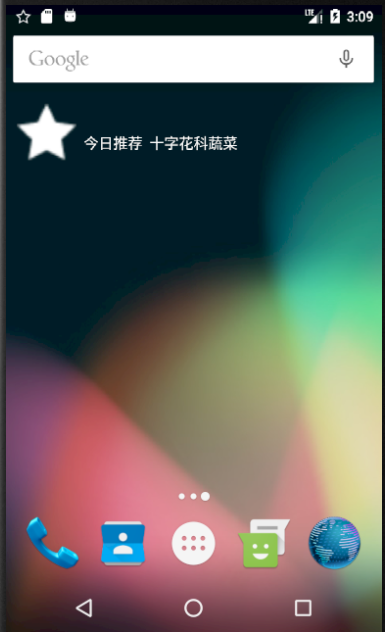
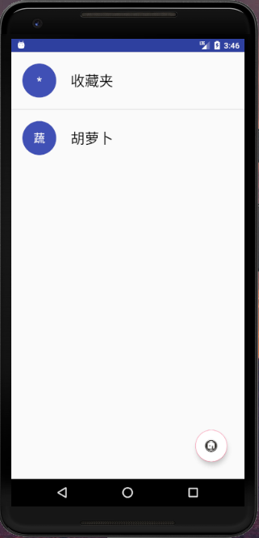

# 中山大学数据科学与计算机学院本科生实验报告
## （2018年秋季学期）
| 课程名称 |  手机平台应用开发   |  任课老师  |        郑贵锋        |
| :--: | :---------: | :----: | :---------------: |
|  年级  |    2016级    | 专业（方向） |       数字媒体        |
|  学号  |  16340294   |   姓名   |        张星         |
|  电话  | 15989001410 | Email  | 1401046908@qq.com |
| 开始日期 | 2018.10.18  |  完成日期  |    2018.10.27     |

---

## 一、实验题目

#### Broadcast 使用 & AppWidget 使用

---

## 二、实现目的

### 第七周：

1. 掌握 Broadcast 编程基础。
2. 掌握动态注册 Broadcast 和静态注册 Broadcast。
3. 掌握Notification 编程基础。
4. 掌握 EventBus 编程基础。

### 第八周：

1. 复习 Broadcast 编程基础。
2. 复习动态注册 Broadcast 和静态注册 Broadcast 。
3. 掌握 AppWidget 编程基础。

---

## 三、实验内容

### 第七周：

在第六周任务的基础上，实现静态广播、动态广播两种改变Notification 内容的方法。

#### 要求

- 在启动应用时，会有通知产生，随机推荐一个食品。
  
  
- 点击通知跳转到所推荐食品的详情界面。
  
  
- 点击收藏图标，会有对应通知产生，并通过Eventbus在收藏列表更新数据。
  
  
- 点击通知返回收藏列表。
  
  
- 实现方式要求:启动页面的通知由静态广播产生，点击收藏图标的通知由动态广播产生。

### 第八周：

在第七周任务的基础上，实现静态广播、动态广播两种改变widget内容的方法。

#### 要求

- widget初始情况如下：
  
  
- 点击widget可以启动应用，并在widget随机推荐一个食品。
  
  
- 点击widget跳转到所推荐食品的详情界面。
  
  
- 点击收藏图标，widget相应更新。
  
  
- 点击widget跳转到收藏列表。
  
  
- 实现方式要求:启动时的widget更新通过静态广播实现，点击收藏图标时的widget更新通过动态广播实现。

---

## 四、课后实验结果

### 第七周：

### (1)实验截图

* 启动页面通知栏弹出“今日推荐”：

  


* 点击，跳转到详情页面：

  

* 点击收藏，通知栏显示收藏成功：

  

* 点击通知栏，跳转到收藏夹页面：

  

### (2)实验步骤以及关键代码

首先是静态广播，先写一个StaticReceiver的类，用来接收静态广播，重写 *onReceive()* 函数：

```java
public void onReceive(Context context, Intent intent){
  if(intent.getAction().equals(STATICACTION)){
    Bundle bundle = intent.getExtras();
    Food food = (Food)bundle.getSerializable(STATICACTION);
    NotificationManager manager=(NotificationManager) context.getSystemService(Context.NOTIFICATION_SERVICE);
    Notification.Builder builder=new Notification.Builder(context);

    builder.setContentTitle("今日推荐")
      .setContentText(food.getName())
      .setTicker("您有一条新消息")
      .setWhen(System.currentTimeMillis())
      .setSmallIcon(R.drawable.empty_star)
      .setAutoCancel(true);

    Intent mIntent = new Intent(context,DetailActivity.class);
    mIntent.putExtra("detail", food);
    PendingIntent mPendingIntent=PendingIntent.getActivity(context,0,mIntent,PendingIntent.FLAG_UPDATE_CURRENT);
    builder.setContentIntent(mPendingIntent);
    Notification notify=builder.build();
    manager.notify(0,notify);
  }
}
```

然后在AndroidManifest.xml里声明：

```xml
<receiver android:name=".StaticReceiver"
          android:exported="true">
  <intent-filter>
    <action android:name="MyStaticReceiver"/>
  </intent-filter>
</receiver>
```

之后在ViewActivity类 *onCreat()* 函数中进行广播以及添加EventBus的订阅：

```java
Random random = new Random();
int i = random.nextInt(data.size());
ComponentName componentName = new ComponentName(getPackageName(),getPackageName()+".StaticReceiver");
Intent intent = new Intent(STATICACTION);
Bundle bundle = new Bundle();
bundle.putSerializable(STATICACTION,data.get(i));
intent.putExtras(bundle);
intent.setComponent(componentName);
sendBroadcast(intent);
EventBus.getDefault().register(this);
```

在 *onDestroy()* 函数中取消订阅：

```java
protected void onDestroy(){
  super.onDestroy();
  EventBus.getDefault().unregister(this);
}
```


 至于DetailActivity中，需要添加动态广播，同理，需要声明一个DynamicReceiver类来接收动态广播，但与StaticReceiver相差无几。但还是有以下语句的差别：


```java
mIntent.putExtra("collect", "listview");
```

此句主要是在跳转到ViewActivity时，告诉其该显示ListView而不是RecyclerView，因为本次我将两个View写在了一个类中。

在DetailActivity中首先需要注册动态广播：

```java
IntentFilter dynamic_filter = new IntentFilter();
dynamic_filter.addAction(DYNAMICACTION);    //添加动态广播的Action
dynamicReceiver = new DynamicReceiver();
registerReceiver(dynamicReceiver, dynamic_filter);    //注册自定义动态广播消息
initDetail();
```

在 *onClick()* 函数中，发送广播，同时作为发布者发布事件。这里的MessageEvent是一个自定义类，只包含了一个成员变量Food：

```java
public void onClick(View view) {
  Toast.makeText(getApplication(),"已收藏",Toast.LENGTH_SHORT).show();
  EventBus.getDefault().post(new MessageEvent(food));
  Intent intent = new Intent(DYNAMICACTION);
  Bundle bundle = new Bundle();
  bundle.putSerializable(DYNAMICACTION,food);
  intent.putExtras(bundle);
  sendBroadcast(intent);
}
```

此时，订阅者根据发布者的事件更新数据，将其收藏到收藏夹数据中：

```java
@Subscribe
public void onEvent(MessageEvent msg){
  collect.add(msg.getFood());
  myListViewAdapter.refresh(collect);
}
```

若点击通知栏消息，从而跳转到收藏夹页面，则需要在ViewActivity中进行处理：

```java
if(this.getIntent().getExtras()!=null){
  if(this.getIntent().getExtras().get("collect")!=null){
    RecyclerView recyclerView = (RecyclerView) findViewById(R.id.recyclerView);
    ListView listView = (ListView)findViewById(R.id.listView);
    recyclerView.setVisibility(View.INVISIBLE);
    listView.setVisibility(View.VISIBLE);
    FloatingActionButton floatingActionButton = (FloatingActionButton)findViewById(R.id.fab);
    floatingActionButton.setImageResource(R.drawable.mainpage);
    tag = 1;
  }
}
```

### (3)实验遇到的困难以及解决思路

第一：我看了群里同学都讨论Android 8.0版本的静态广播，于是就看了很久的博客及官方文档，但写了之后虚拟机总是没有反应。思考良久，最终发现我的虚拟机安卓版本是6.0的。改了之后就可以正常弹出了。

第二：一开始点击Detail不能够正确显示详情，总是显示菜单里第一项的内容，最终查了博客，发现是PendingIntent的Flag参数没有设对，默认的是0，应该予以修改：

```java
PendingIntent mPendingIntent=PendingIntent.getActivity(context,0,mIntent,PendingIntent.FLAG_UPDATE_CURRENT);
```

第三：上次因为没有将两个View写在一个类里面，吃了很多亏，而且吃力不讨好，所以做这次作业前，我先按照TA上次的文档，把上次的两个View整合到了一起，然后再写这次作业。在点击了收藏之后，再点击上方通知栏内容，需要跳转到收藏夹页面，一开始我不知道如何通知ViewActivity切换View，仔细想了之后可以将通知信息放入Intent里面，然后在View里get到某些内容，就可以切换场景了：

```java
mIntent.putExtra("collect", "listview");
```

```java
if(this.getIntent().getExtras()!=null){
  if(this.getIntent().getExtras().get("collect")!=null){
    RecyclerView recyclerView = (RecyclerView) findViewById(R.id.recyclerView);
    ListView listView = (ListView)findViewById(R.id.listView);
    recyclerView.setVisibility(View.INVISIBLE);
    listView.setVisibility(View.VISIBLE);
    FloatingActionButton floatingActionButton = (FloatingActionButton)findViewById(R.id.fab);
    floatingActionButton.setImageResource(R.drawable.mainpage);
    tag = 1;
  }
}
```

第四：在用了singleInstance之后，一开始也不能正常工作，然后查阅资料，发现应该重写 *onNewIntent()* 函数，之后就好了。

第五：EventBus的取消订阅一开始不知道写在哪里，最后查了一下周期，以及网上的博客，最后写在了 *onDestroy()* 函数中：

```java
@Override
protected void onDestroy(){
  super.onDestroy();
  EventBus.getDefault().unregister(this);
}
```

### 第八周：

### (1)实验截图

* 初始状态：

  

* 点击，启动应用，更新推荐，此处我采用与上方通知栏一样的空心图标：

  


* 点击推荐，进入详情页面：

  

* 点击收藏，更新内容：

  

* 点击，进入收藏夹页面：

  

### (2)实验步骤以及关键代码

首先新建NewAppWidget类，然后修改new_app_widget.xml，一个ImageView和一个TextView：
```xml
<ImageView
    android:layout_width="wrap_content"
    android:layout_height="wrap_content"
    android:id="@+id/appwidget_image"
    android:src="@drawable/full_star"/>

<TextView
    android:id="@+id/appwidget_text"
    android:layout_width="wrap_content"
    android:layout_height="wrap_content"
    android:layout_alignBottom="@+id/appwidget_image"
    android:layout_toRightOf="@id/appwidget_image"
    android:layout_marginLeft="20dp"
    android:contentDescription="@string/appwidget_text"
    android:gravity="center_vertical"
    android:text="@string/appwidget_text"
    android:textColor="@color/colorWhite"
    android:textSize="15sp" />
```

其次，重写 *onUpdate()* 函数，设置widget初始状态和点击函数，这样就可以实现点击widget进入应用界面了：

```java
RemoteViews updateView = new RemoteViews(context.getPackageName(), R.layout.new_app_widget);//实例化RemoteView,其对应相应的Widget布局
Intent i = new Intent(context, ViewActivity.class);
PendingIntent pi = PendingIntent.getActivity(context, 0, i, PendingIntent.FLAG_UPDATE_CURRENT);
updateView.setOnClickPendingIntent(R.id.appwidget_image, pi); //设置点击事件
ComponentName me = new ComponentName(context, NewAppWidget.class);
appWidgetManager.updateAppWidget(me, updateView);
```

之后，在ViewActivity的 *onCreate()* 函数中添加静态广播，更新widget的今日推荐；同时，在NewAppWidget类的 *onReceive()* 函数中处理静态广播，更新文本内容与图片，这里我才用了空心图标，与通知栏图标保持一致。
      
当更新了推荐内容之后，也要更新点击函数，使点击之后进入Detail页面：

```java
bundle.putSerializable(WIDGETSTATICACTION,data.get(randomNumber));
Intent widgetIntentBroadcast = new Intent();
widgetIntentBroadcast.setAction(WIDGETSTATICACTION);
widgetIntentBroadcast.putExtras(bundle);
sendBroadcast(widgetIntentBroadcast);
```
```java
if(intent.getAction().equals(WIDGETSTATICACTION)) {
    RemoteViews view = new RemoteViews(context.getPackageName(), R.layout.new_app_widget);
    Food food = (Food) bundle.getSerializable(WIDGETSTATICACTION);
    view.setTextViewText(R.id.appwidget_text, "今日推荐 " + food.getName());
    view.setImageViewResource(R.id.appwidget_image, R.drawable.empty_star);

    Intent i = new Intent(context, DetailActivity.class);
    i.putExtra("detail", food);
    PendingIntent pi = PendingIntent.getActivity(context, 0, i, PendingIntent.FLAG_UPDATE_CURRENT);
    view.setOnClickPendingIntent(R.id.appwidget_image, pi); //设置点击事件
    ComponentName me = new ComponentName(context, NewAppWidget.class);
    appWidgetManager.updateAppWidget(me, view);
}
```

当在详情页面点击收藏之后，在上周的基础上也要添加一个动态广播，使widget完成更新：
```java
Intent widgetIntentBroadcast = new Intent();   //定义Intent
widgetIntentBroadcast.setAction(WIDGETDYNAMICACTION);
bundle.putSerializable(WIDGETDYNAMICACTION,food);
widgetIntentBroadcast.putExtras(bundle);
sendBroadcast(widgetIntentBroadcast);
```

然后在DynamicReceiver中接收广播并处理：
```java
if(intent.getAction().equals(WIDGETDYNAMICACTION)){
    AppWidgetManager appWidgetManager = AppWidgetManager.getInstance(context);
    Bundle bundle = intent.getExtras();
    RemoteViews view = new RemoteViews(context.getPackageName(), R.layout.new_app_widget);
    Food food = (Food)bundle.getSerializable(WIDGETDYNAMICACTION);
    view.setTextViewText(R.id.appwidget_text, "已收藏 "+food.getName());
    view.setImageViewResource(R.id.appwidget_image,R.drawable.full_star);

    Intent i = new Intent(context, ViewActivity.class);
    i.putExtra("collect", "listview");
    PendingIntent pi = PendingIntent.getActivity(context, 0, i, PendingIntent.FLAG_UPDATE_CURRENT);
    view.setOnClickPendingIntent(R.id.appwidget_image, pi); //设置点击事件
    ComponentName me = new ComponentName(context, NewAppWidget.class);
    appWidgetManager.updateAppWidget(me, view);
}
```
这样再点击widget就会进入收藏夹页面了。

### (3)实验遇到的困难以及解决思路
第一：在设置静态广播时，第一次将其放入了 *onRestart()* 中，但是这样第一次启动应用时就无法更新widget内容，而且经常会出现预料之外的“今日推荐”，所以我将其写入了ViewActivity的 *onCreate()* 中，就解决了这一问题。

第二：动态广播的设置，我一开始将其写在NewAppWidget的 *onReceive()* 中，但是这样无法正常接收。随后我新建了一个Receiver类，也不可以接收；最后我尝试性地将其放入之前的DynamicReceiver类中，就可以正常接收了。

---

## 五、实验思考及感想
### 第七周

在每次实验之前，看TA的文档真的是会有很多收获，免得我走很多弯路。本次作业相对上周，简单了很多，工作量也少了很多。上周倔强了一周，终于勉强完成了作业，但这周假如还用之前的结构，我觉得又会有一堆的跳转需要处理，而且会出现一大堆问题，所以毅然先按照TA的文档改一下结构，再写这次作业。

改了之后发现两个View切换起来果然简单了很多，之后就按照实验要求来写。重写 *onNewIntent()* 的时候，几乎将所有 *onCreate()* 函数里的代码都搬过去，最后发现好像只用写切换View部分就OK啦。经过这次实验，广播机制和EventBus有了更多了解，对于单例模式也有一定认识。

是一个作业的过程，也是一个学习的过程。

### 第八周
      
本周只是在上周的基础上添加了widget，静态和动态广播由于上周已经写过，所以驾轻就熟。但即使这样，依然出现了一些问题，也花费了许多时间来调试，经过查阅资料，解决了问题。

对于widget也有了更多了解，当它的属性更改之后，也需要及时的设置点击函数，否则就会出现bug。

---

#### 作业要求
* 命名要求：学号_姓名_实验编号，例如12345678_张三_lab1.md
* 实验报告提交格式为md
* 实验内容不允许抄袭，我们要进行代码相似度对比。如发现抄袭，按0分处理