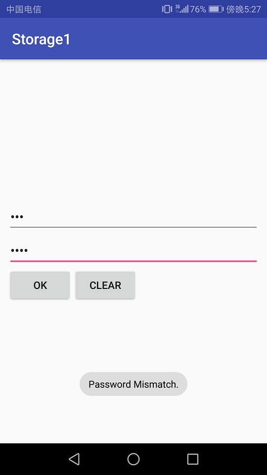
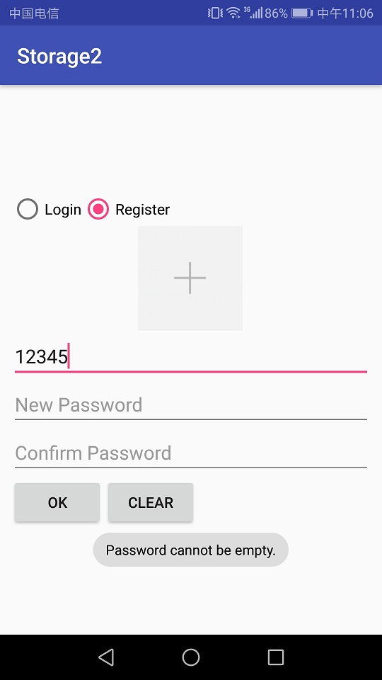

# 中山大学数据科学与计算机学院本科生实验报告

## （2018年秋季学期）


| 课程名称 |  手机平台应用开发   |  任课老师  |        郑贵锋        |
| :--: | :---------: | :----: | :---------------: |
|  年级  |    2016级    | 专业（方向） |       数字媒体        |
|  学号  |  16340294   |   姓名   |        张星         |
|  电话  | 15989001410 | Email  | 1401046908@qq.com |
| 开始日期 | 2018.11.07 | 完成日期 | 2018.11.14

---

## 一、实验题目

### 数据存储应用开发

---

## 二、实验目的

### 第九周
1. 学习SharedPreference的基本使用。
2. 学习Android中常见的文件操作方法。
3. 复习Android界面编程。

### 第十一周

1. 学习SQLite数据库的使用。
2. 学习ContentProvider的使用。
3. 复习Android界面编程。

---

## 三、实现内容

### 第九周
### 要求
* Figure 1：首次进入，呈现创建密码界面。


* Figure 2：若密码不匹配，弹出Toast提示。


* Figure 3：若密码为空，弹出Toast提示。


* Figure 4：退出后第二次进入呈现输入密码界面。


* Figure 5：若密码不正确，弹出Toast提示。


* Figure 6：文件加载失败，弹出Toast提示。


* Figure 7：成功保存文件，弹出Toast提示。


* Figure 8：成功导入文件，弹出Toast提示。


### 第十一周

### 要求

| 图1.1 点击Login切换到登录界面 | 图1.2 若Username为空，则发出Toast提示 |
| ---------------------------------------- | ---------------------------------------- |
| 图1.3 若Password为空，则发出Toast提示 | 图1.4 若Username不存在，则发出Toast提示 |
| 图1.5 若密码不正确，则发出Toast提示 |                                          |
| 图2.1 点击Register切换到注册页面 | 图2.2 若Username为空，则发出Toast提示 |
| 图2.3 若New Password为空，则发出Toast提示 | 图2.4 若New Password与Confirm Password不匹配，则发出Toast提示 |
| 图2.5 若Username已经存在，则发出Toast提示 |                                          |
| 图3.1 评论页面 | 图3.2 若EditText为空，则发出Toast提示 |
| 图3.3 短按评论：弹出对话框，显示该评论的用户以及通讯录中该用户的电话号码 | 图3.4 短按评论：弹出对话框，显示该评论的用户以及通讯录中该用户的电话号码 |
| 图3.5 弹出是否删除的对话框 | 图3.6 弹出是否举报的对话框 |
| 图4.1 进入手机图库进行图片选择 | 图4.2 ImageView显示本次选择的图片 |
| 图4.3 在评论页面，每条Item应当正确显示用户的头像 |                                          |

---

## 四、课后实验结果
### 第九周
### (1)实验截图
* 首次进入：


* 密码不匹配：


* 密码为空：


* 注册成功，第二次进入：


* 密码不正确：


* 文件加载失败：


* 成功保存：


* 成功导入：


### (2)实验步骤以及关键代码

* 使用SharedPreferences存储密码，若已经存储过，则再次打开时将newPassword设为不可见，然后修改confirmPassword的Hint即可。
```java
SharedPreferences sharedPref = getSharedPreferences("Storage", Context.MODE_PRIVATE);
final SharedPreferences.Editor editor = sharedPref.edit();
final EditText editText1 = (EditText)findViewById(R.id.new_password);
final EditText editText2 = (EditText)findViewById(R.id.confirm_password);

final String password = sharedPref.getString("password","");
if(!password.isEmpty()){
    editText1.setVisibility(View.INVISIBLE);
    editText2.setHint("Password");
    flag = 1;
}
```
* 点击OK，若第一次注册，且密码符合规定，则保存：
```java
if(flag==0){
    if(password1.isEmpty()){
        Toast.makeText(getApplication(), "Password cannot be empty.", Toast.LENGTH_SHORT).show();
    }
    else if(!password1.equals(password2)){
        Toast.makeText(getApplication(), "Password Mismatched.", Toast.LENGTH_SHORT).show();
    }
    else {
        Intent intent = new Intent(Storage1.this, FileActivity.class);
        editor.putString("password",password1);
        editor.commit();
        startActivity(intent);
    }
}
```
* 否则，则只需进行密码匹配即可：
```java
else{
    if(password2.equals(password)){
        Intent intent = new Intent(Storage1.this, FileActivity.class);
        startActivity(intent);
    }
    else{
        Toast.makeText(getApplication(),"Invalid Password.", Toast.LENGTH_SHORT).show();
    }
}
```
* 点击CLEAR，清空输入框：
```java
button2.setOnClickListener(new View.OnClickListener() {
    @Override
    public void onClick(View v) {
        editText2.setText("");
        if(flag==0){
            editText1.setText("");
        }
    }
});
```
* 进入第二个页面，点击SAVE：
```java
button1.setOnClickListener(new View.OnClickListener() {
    @Override
    public void onClick(View v) {
        try {
            FileOutputStream fileOutputStream = openFileOutput("File", MODE_PRIVATE);
            String str = editText.getText().toString();
            fileOutputStream.write(str.getBytes());
            fileOutputStream.flush();
            fileOutputStream.close();
            Toast.makeText(getApplication(),"Save successfully.", Toast.LENGTH_SHORT).show();
        } catch (IOException ex) {
            Toast.makeText(getApplication(),"Fail to save file.", Toast.LENGTH_SHORT).show();
        }
    }
});
```
* 点击LOAD：
```java
button2.setOnClickListener(new View.OnClickListener() {
    @Override
    public void onClick(View v) {
        try {
            FileInputStream fileInputStream = openFileInput("File");
            byte[] contents = new byte[fileInputStream.available()];
            StringBuilder sb = new StringBuilder("");
            int len = 0;
            while((len = fileInputStream.read(contents))>0){
                sb.append(new String(contents, 0, len));
            }
            fileInputStream.close();
            editText.setText(sb.toString());
            Toast.makeText(getApplication(),"Load successfully.", Toast.LENGTH_SHORT).show();
        } catch (IOException ex) {
            Toast.makeText(getApplication(),"Fail to load file.", Toast.LENGTH_SHORT).show();
        }
    }
});
```
* 点击CLEAR，与之前效果相同，不做赘述。

### (3)实验遇到的困难以及解决思路

1. 布局方面有点问题，一开始使用约束布局，实现占满比较麻烦，而且看到下面的三个按钮要均匀分布，于是就换了线性布局，很简单就实现了要求的效果。
2. 在LOAD时，一开始不知道如何读入文件，将其转化为String，后来仔细查看课件和查找资料，使用StringBuilder，最后顺利解决了。  

---

### 第十一周

### （1）实验截图

* 登陆页面:

 
* 用户名不能为空


* 密码不能为空

 
* 用户不存在


* 密码不正确


* 注册页面


* 用户名不能为空


* 密码不能为空


* 密码不匹配


* 用户名已存在


* 登陆成功


* 评论内容不能为空


* 显示电话号码（虚拟机内电话号码存储格式有差别）


* 电话号码不存在


* Delete


* Report


* 选择头像


* 正常显示头像


### （2）实验步骤及关键代码

* 首先是UI，使用RadioGroup，实现注册和登陆的选择，设置一个confirm password的TextView，通过visible属性来控制其显示与隐藏。同时，用于显示头像的ImageView也是此理。

```xml
<EditText
    android:layout_width="match_parent"
    android:layout_height="wrap_content"
    android:id="@+id/confirm"
    android:hint="@string/confirm"
    app:layout_constraintTop_toBottomOf="@+id/password"
    app:layout_constraintLeft_toLeftOf="parent"
    android:layout_marginLeft="10dp"
    android:layout_marginRight="10dp"
    android:layout_marginTop="10dp"
    android:inputType="textPassword"
    android:visibility="gone"/>

<ImageView
    android:layout_width="120dp"
    android:layout_height="120dp"
    app:layout_constraintBottom_toTopOf="@+id/username"
    app:layout_constraintLeft_toLeftOf="parent"
    app:layout_constraintRight_toRightOf="parent"
    android:src="@drawable/add"
    android:scaleType="center"
    android:id="@+id/imageView"
    android:visibility="gone"/>
```
* 设置选择头像与确定密码框显示与否。
```java
radioGroup.setOnCheckedChangeListener(new RadioGroup.OnCheckedChangeListener() {
    @Override
    public void onCheckedChanged(RadioGroup group, int checkedId) {
        if (checkedId == R.id.register){
            flag = 1;
            confirm.setVisibility(View.VISIBLE);
            imageView.setVisibility(View.VISIBLE);
            password.setText("");
        }
        else{
            flag = 0;
            confirm.setVisibility(View.GONE);
            imageView.setVisibility(View.GONE);
            password.setText("");
            confirm.setText("");
        }
    }
});
```
* 然后新建一个类，名为Member，用以存储用户信息。
```java
private String username;
private String password;
private String phoneNumber;
private Bitmap portrait;//头像
```
* 还有另一个类名为Comment，存储评论信息。
```java
private Integer id;
private String username;
private String time;
private String comment;
private Integer count;
private Integer like;
```
* 接着就是数据库了。本次项目共有三个数据库，分别是MemberDB，CommentDB，LikeDB，用于存储用户信息，评论信息以及点赞信息。
首先是MemberDB，存储Member的信息，其中头像在数据库中用BLOG类型存储。
```java
String CREATE_TABLE = "CREATE TABLE if not exists "
        + TABLE_NAME
        + " ( username STRING PRIMARY KEY, password  STRING, phoneNumber STRING, portrait BLOG)";
sqLiteDatabase.execSQL(CREATE_TABLE);
```
* 插入数据库时，难点在于插入图片。我根据网上的资料，将Member中的Bitmap转为ByteArrayOutputStream，然后进行插入。
```java
public long insert(Member m){
    SQLiteDatabase db = getWritableDatabase();
    ContentValues cv = new ContentValues();
    final ByteArrayOutputStream os = new ByteArrayOutputStream();
    m.getPortrait().compress(Bitmap.CompressFormat.PNG, 100, os);
    cv.put("username", m.getUsername());
    cv.put("password", m.getPassword());
    cv.put("phoneNumber", m.getPhoneNumber());
    cv.put("portrait", os.toByteArray());
    long rid = db.insert(TABLE_NAME,null,cv);
    db.close();
    return rid;
}
```
* 其次是CommentDB，存储了用户名，其头像可从MemberDB中查询，然后就是要求中的其他项目。
```java
String CREATE_TABLE = "CREATE TABLE if not exists "
        + TABLE_NAME
        + " (_id INTEGER PRIMARY KEY, username STRING, time STRING, comment STRING, count INTEGER, likes INTEGER)";
sqLiteDatabase.execSQL(CREATE_TABLE);
```
* 最后一个数据库就是LikeDB了，它用于存储点赞关系，共有两列，一列是CommentID，另一列是Username，用这两个属性就可以在其他两个数据库里唯一地标识两项，所以就能够进行准确地判断。当登陆成功后，进入评论页面，加载列表时，对于评论中的每一项都要在LikeDB中进行查询，若存在，则将点赞图片设为红色；若不存在，则设为蓝色。当一条评论被删除时，也无需对LikeDB进行相应的删除操作，因为Comment在数据库中是按顺序插入的，不可能出现两条ID相同的评论，当然删了也并无不可。
```java
String CREATE_TABLE = "CREATE TABLE if not exists "
        + TABLE_NAME
        + " (_id INTEGER PRIMARY KEY, username STRING, commentId INTEGER)";
sqLiteDatabase.execSQL(CREATE_TABLE);
```
* 数据库建立完毕，既可以进行注册了。先要进行条件判断，符合条件并确认密码后，将账号信息插入数据库。
```java
Resources res = getResources();
Bitmap bmp = null;
if(select == 0){
    bmp = BitmapFactory.decodeResource(res, R.drawable.me);
}
else{
    imageView.setDrawingCacheEnabled(true);
    bmp = imageView.getDrawingCache().copy(Bitmap.Config.RGB_565, false);
    imageView.setDrawingCacheEnabled(false);
}

Member mem = new Member(username.getText().toString(),password.getText().toString(),null,bmp);
MemDB.insert(mem);//database
```
* 注册时，需要自选择头像，这里使用文档中的方式实现，并添加了压缩算法。若要访问图库，首先要申请权限，在AndroidManifest.xml中声明，然后在Activity中进行申请，这里我申请了通讯录和读取存储的权限，通讯录在后面获取电话号码会用到。
```xml
<uses-permission android:name="android.permission.READ_CONTACTS"/>
<uses-permission android:name="android.permission.READ_EXTERNAL_STORAGE"/>
```
```java
private String[] permissions = new String[]{Manifest.permission.READ_EXTERNAL_STORAGE, Manifest.permission.READ_CONTACTS};
List<String> mPermissionList = new ArrayList<>();

//写在onCreate中
for(int i = 0;i < permissions.length;i++){
    if(ContextCompat.checkSelfPermission(this, permissions[i])!= PackageManager.PERMISSION_GRANTED){
        mPermissionList.add(permissions[i]);
    }
}
if (mPermissionList.size()>0){
    ActivityCompat.requestPermissions(this, permissions, 1);
}

//另写一个函数
public void onRequestPermissionsResult(int requestCode, String permissions[], int[] grantResults) {
    super.onRequestPermissionsResult(requestCode, permissions, grantResults);
    if(requestCode == 1){
        for(int i = 0;i < grantResults.length;i++){
            if (grantResults[i] != PackageManager.PERMISSION_GRANTED) {
                //判断是否勾选禁止后不再询问
                boolean showRequestPermission = ActivityCompat.shouldShowRequestPermissionRationale(this, permissions[i]);
                if (showRequestPermission) {
                    Toast.makeText(getApplication(),"权限未申请",Toast.LENGTH_SHORT).show();
                }
            }
        }
    }
}
```
* 添加图片，还要实现压缩的功能。这里我采用了文档中即博客的方法。
```java
public void load(View view) {
    Intent intent = new Intent();
    intent.setAction(Intent.ACTION_PICK);
    intent.setType("image/*");
    startActivityForResult(intent, 0);
}

@Override
protected void onActivityResult(int requestCode, int resultCode, Intent data) {
    if (data != null) {
        Uri uri = data.getData();
        Bitmap original = null;

        String[] filePathColumns = {MediaStore.Images.Media.DATA};
        Cursor c = getContentResolver().query(uri, filePathColumns, null, null, null);
        c.moveToFirst();
        int columnIndex = c.getColumnIndex(filePathColumns[0]);
        String imagePath = c.getString(columnIndex);
        c.close();

        // 设置参数
        BitmapFactory.Options options = new BitmapFactory.Options();
        options.inJustDecodeBounds = true; // 只获取图片的大小信息，而不是将整张图片载入在内存中，避免内存溢出
        BitmapFactory.decodeFile(imagePath, options);
        int height = options.outHeight;
        int width= options.outWidth;
        int inSampleSize = 2; // 默认像素压缩比例，压缩为原图的1/2
        int minLen = Math.min(height, width); // 原图的最小边长
        if(minLen > 100) { // 如果原始图像的最小边长大于100dp
            float ratio = (float)minLen / 100.0f; // 计算像素压缩比例
            inSampleSize = (int)ratio;
        }
        options.inJustDecodeBounds = false; // 计算好压缩比例后，这次可以去加载原图了
        options.inSampleSize = inSampleSize; // 设置为刚才计算的压缩比例
        Bitmap bm = BitmapFactory.decodeFile(imagePath, options); // 解码文件
        imageView.setScaleType(ImageView.ScaleType.FIT_CENTER);
        imageView.setImageBitmap(bm);
    }
    super.onActivityResult(requestCode, resultCode, data);
}
```
* 评论页面的Item使用ListView实现，所以要重写Adapter，与之前的并无太大差别，重点在于头像与点赞图片的设置：
```java
Drawable bd= new BitmapDrawable(m.getPortrait());
viewHolder.portrait.setImageDrawable(bd);

if(list.get(i).getLike()==0){
    viewHolder.like.setImageResource(R.drawable.white);
}
else{
    viewHolder.like.setImageResource(R.drawable.red);
}
```
* 评论功能，若为空则不能发。否则获取系统时间并格式化，添加到新的Comment中。
```java
//SEND的点击事件
send.setOnClickListener(new View.OnClickListener() {
    @Override
    public void onClick(View v) {
        if(editText.getText().toString().equals("")){
            Toast.makeText(getApplication(), "Comment cannot be empty.", Toast.LENGTH_SHORT).show();
        }
        else{
            SimpleDateFormat simpleDateFormat = new SimpleDateFormat("yyyy-MM-dd HH:mm:ss");
            Date curDate =  new Date(System.currentTimeMillis());
            String time = simpleDateFormat.format(curDate);
            Comment comment = new Comment(username, time, editText.getText().toString(),0, 0);
            long l = commentDB.insert(comment);
            int i = (int)l;
            comment.setId(commentDB.getById(i).getId());
            data.add(comment);
            editText.setText("");
            myListViewAdapter.refresh(data);
        }
    }
});
```
* Item的点击事件，查询通讯录，若查到，则按照对应格式显示；若无，则显示提示信息。
```java
listView.setOnItemClickListener(new AdapterView.OnItemClickListener() {
    @Override
    public void onItemClick(AdapterView<?> parent, View view, int position, long id) {
        AlertDialog.Builder alertDialog = new AlertDialog.Builder(CommentActivity.this);
        String[] selectArgs = {data.get(position).getUsername()};
        Cursor cursor = getContentResolver().query(ContactsContract.CommonDataKinds.Phone.CONTENT_URI,null, ContactsContract.CommonDataKinds.Phone.DISPLAY_NAME + " = ?", selectArgs, null);
        String number = null;
        if(cursor.getCount()!=0){
            cursor.moveToFirst();
            number = "\nPhone: ";
            do {
                String phone = cursor.getString(cursor.getColumnIndex(ContactsContract.CommonDataKinds.Phone.NUMBER));
                number +=  phone.substring(0,3)+ " " + phone.substring(3, 7)+ " "+
                        phone.substring(7,11)+ "\n             ";
            } while (cursor.moveToNext());
        }
        else{
            number = "\nPhone number not exist.";
        }
        alertDialog.setTitle("Info").setMessage("Username: "+ data.get(position).getUsername()+number).setPositiveButton("OK",
                new DialogInterface.OnClickListener() {
                    @Override
                    public void onClick(DialogInterface dialog, int which) {
                    }
                });
        alertDialog.show();
    }
});
```
* 长按事件，Delete/Report，通过获取当前的用户名与Item的用户名，若相同，则为Delete；否则为Report。
```java
listView.setOnItemLongClickListener(new AdapterView.OnItemLongClickListener() {
    @Override
    public boolean onItemLongClick(AdapterView<?> adapterView, View view, int i, long l) {
        final int position = i;
        AlertDialog.Builder alertDialog = new AlertDialog.Builder(CommentActivity.this);
        if(commentDB.getById(data.get(i).getId()).getUsername().equals(username)){//检查
            alertDialog.setMessage("Delete or not?").setPositiveButton("YES",
                    new DialogInterface.OnClickListener() {
                        @Override
                        public void onClick(DialogInterface dialog, int which) {
                            likeDB.deleteById(data.get(position).getId());
                            commentDB.deleteById(data.get(position).getId());
                            data.remove(position);
                            myListViewAdapter.refresh(data);
                        }
                    }).setNegativeButton("NO",
                    new DialogInterface.OnClickListener() {
                        @Override
                        public void onClick(DialogInterface dialog, int which) {
                        }
                    });
        }
        else{
            alertDialog.setMessage("Report or not?").setPositiveButton("YES",
                    new DialogInterface.OnClickListener() {
                        @Override
                        public void onClick(DialogInterface dialog, int which) {

                        }
                    }).setNegativeButton("NO",
                    new DialogInterface.OnClickListener() {
                        @Override
                        public void onClick(DialogInterface dialog, int which) {
                        }
                    });
        }

        alertDialog.show();
        return true;
    }
});
```
* 点赞按钮，需要在Adapter中设置对应接口，并在Activity中写相应的函数。
```java
myListViewAdapter.setOnItemLikeClickListener(new MyListViewAdapter.onItemLikeListener() {
    @Override
    public void onLikeClick(int i) {
        if(data.get(i).getLike() == 0){
            data.get(i).setLike(1);
            Integer integer = data.get(i).getCount();
            data.get(i).setCount(integer+1);
            likeDB.insert(username, data.get(i).getId());
        }
        else{
            data.get(i).setLike(0);
            Integer integer = data.get(i).getCount();
            data.get(i).setCount(integer-1);
            likeDB.delete(username, data.get(i).getId());//取消点赞，必须在LikeDB中删除
        }

        commentDB.update(data.get(i));
        myListViewAdapter.refresh(data);
    }
});
```

### （3）实验遇到的困难以及解决思路

困难一：一开始每次启动软件，总是不会申请任何权限，并且进入到应用管理页面，也没有任何权限列表，所以也就无法读取图片。

解决方法：是文档中给的提示有误，虽然TA后面更新了文档，但是因为我没有及时更新我的仓库所以导致一直卡在这里。修改AndroidManifest中第一行申请权限的语句即可解决。

困难二：读入图片后，未进行压缩，导致读入后总是不能显示；存入数据库中再进行读入，显示一片黑。

解决方法：在网上找到一种靠谱的压缩方法后，得以解决。

困难三：点赞关系存储。一开始我想将点赞人存储到Comment中，但是又觉得太繁琐。

解决方法：使用一个新的LikeDB来存储点赞关系，用commentID标识每一条Comment，用Username标识每一个用户，这样每一个用户不能对同一条评论点赞两次，并且简洁明了，无论增删都不会出现错误。

---

## 五、实验思考及感想

### 第九周
本次实验较为简单，基本难点老师课上和TA给的指导文档已经有了解决方法，所以完成起来还算顺利。本次实验采用了sharedPreference，但这样是不好的，在之后必须学习更好的解决方法，以确保安全性。

---

### 第十一周
这部分相对于上部分，内容多了很多，也复杂了很多。一开始不会数据库的使用，按照文档提示，打算用execSQL来写，但是这样无疑复杂很多，于是还是用相应的增删，更新函数来实现相应功能。经过实验，对于数据库的性质又有所复习，同时对SQLite的函数更加熟悉。

实验的另一大难点就是权限问题，一开始无法访问图库，最终查了半天找到原因，是因为单词拼错。解决后却需要每次进行手动到应用管理授权。后来我想像应用商店里的app那样，安装时就申请权限，然后查了资料后，将需要的权限插入数组，在启动Activity中申请，实现了这一功能，方便了很多。

本次实验总的来说还是相当有难度的，有好多的地方需要我们去自主学习并实现，但是也对Android更为了解了，对日常使用app的运行机理进行了学习，收获匪浅。

#### 加分项
* 实现了图库选取图片功能，若不选，则使用默认头像。
* 实现了点赞功能，并用数据库予以存储。

#### 作业要求
* 命名要求：学号_姓名_实验编号，例如12345678_张三_lab1.md
* 实验报告提交格式为md
* 实验内容不允许抄袭，我们要进行代码相似度对比。如发现抄袭，按0分处理