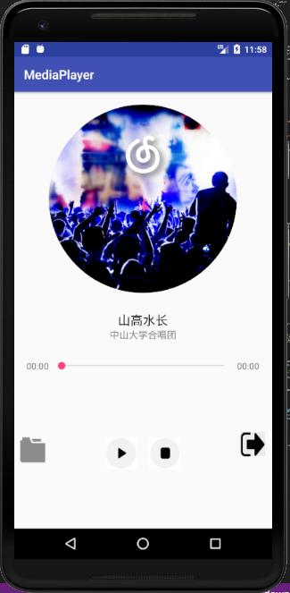
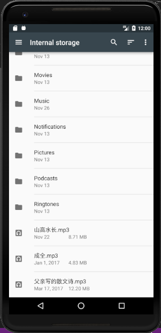

# 中山大学数据科学与计算机学院本科生实验报告
## （2018年秋季学期）
| 课程名称 |  手机平台应用开发   |  任课老师  |       郑贵锋       |
| :--: | :---------: | :----: | :-------------: |
|  年级  |    2016级    | 专业（方向） |     数字媒体方向      |
|  学号  |  16340294   |   姓名   |       张星        |
|  电话  | 15989001410 | Email  | dukestar@qq.com |
| 开始日期 | 2018.11.23 | 完成日期 | 2018.12.05

---

## 一、实验题目

### 简单音乐播放器
---

## 二、实验目的

1. 学会使用MediaPlayer
2. 学会简单的多线程编程，使用Handler更新UI
3. 学会使用Service进行后台工作
4. 学会使用Service与Activity进行通信
5. 学习rxJava，使用rxJava更新UI

---

## 三、实现内容

实现一个简单的播放器，要求功能有：

|  打开程序主页面 |  开始播放 |
| ------------------------------ | --------------------------- |
|  暂停      |  停止   |

1. 播放、暂停、停止、退出功能，按停止键会重置封面转角，进度条和播放按钮；按退出键将停止播放并退出程序
2. 后台播放功能，按手机的返回键和home键都不会停止播放，而是转入后台进行播放
3. 进度条显示播放进度、拖动进度条改变进度功能
4. 播放时图片旋转，显示当前播放时间功能，圆形图片的实现使用的是一个开源控件CircleImageView
5. 在保持上述原有的功能的情况下，使用rxJava代替Handler进行UI的更新

---

## 四、课后实验结果
### (1)实验截图

|   |  |
| ------------------------------------- | ---------------------------------- |
|打开主页面  |开始播放   |
|     |  |
|暂停  |停止   |
|  |   |
|选歌  |更新   |
|   |   |
|播放  |暂停   |


### (2)实验步骤以及关键代码

* 首先，是xml文件的编写，其中需要用到CircleImageView和SeekBar，分别为专辑封面和进度条。
```xml

<com.example.zhangxing.mediaplayer.CircleImageView
    android:id="@+id/image"
    app:layout_constraintTop_toTopOf="parent"
    android:layout_marginTop="20dp"
    android:layout_width="300dp"
    android:layout_height="300dp"
    app:layout_constraintLeft_toLeftOf="parent"
    app:layout_constraintRight_toRightOf="parent"
    android:src="@drawable/img"/>
<SeekBar
    android:id="@+id/bar"
    app:layout_constraintTop_toBottomOf="@+id/singer"
    android:layout_marginTop="30dp"
    android:layout_marginLeft="60dp"
    android:layout_marginRight="60dp"
    android:layout_width="match_parent"
    android:layout_height="wrap_content" />
```

* 接着在AndroidManifest.xml中添加权限申请。
```xml
<uses-permission android:name="android.permission.WRITE_EXTERNAL_STORAGE"/>
```

* Service类：有一个MediaPlayer的变量。
```java
public MusicService(){
    mediaPlayer = new MediaPlayer();
    try {
        mediaPlayer.setDataSource("/storage/emulated/0/山高水长.mp3");
        mediaPlayer.prepare();
    } catch (IOException e) {
        e.printStackTrace();
    }
}
```

* 播放音乐，暂停，以及停止。停止音乐需要先暂停，再进行reset。
```java
public void playMusic(){
    if (mediaPlayer.isPlaying()){
        mediaPlayer.pause();
    }else{
        mediaPlayer.start();
    }
}
public void stopMusic(){
    if (mediaPlayer != null) {
        mediaPlayer.stop();
        try {
            mediaPlayer.prepare();
            mediaPlayer.seekTo(0);
        } catch (Exception e) {
            e.printStackTrace();
        }
    }
}
public void setMusic(String str){
    if (mediaPlayer != null) {
        mediaPlayer.stop();
        try {
            mediaPlayer.prepare();
            mediaPlayer.seekTo(0);
        } catch (Exception e) {
            e.printStackTrace();
        }
    }

    try {
        mediaPlayer.reset();
        mediaPlayer.setDataSource(str);
        mediaPlayer.prepare();
    } catch (IOException e) {
        e.printStackTrace();
    }
}
```

* Activity类，通过写好的Service类来调整音乐的播放，暂停等。首先需要绑定Service。
```java
private void bindMusicService() {
    Intent intent = new Intent(this, MusicService.class);
    bindService(intent, sc, BIND_AUTO_CREATE);
}
```

* 绑定成功后调用以下回调函数，获取Service对象。在其中设置歌曲总时长，与播放完成后复原的操作。
```java
private ServiceConnection sc = new ServiceConnection() {
    @Override
    public void onServiceConnected(ComponentName name, IBinder service) {
        musicService = ((MusicService.MyBinder) service).getService();
        total.setText(time.format(musicService.mediaPlayer.getDuration()));
        musicService.mediaPlayer.setOnCompletionListener(new MediaPlayer.OnCompletionListener() {
            @Override
            public void onCompletion(MediaPlayer mp) {
                play.setTag("0");
                play.setImageResource(R.drawable.play);
                animator.end();
                flag = true;
            }
        });
    }

    @Override
    public void onServiceDisconnected(ComponentName name) {
        musicService = null;
    }
};
```
* 当点击back时，需要解绑Service并退出。
```java
handler.removeCallbacks(runnable);
unbindService(sc);
try {
    MainActivity.this.finish();
    System.exit(0);
} catch (Exception e) {
    e.printStackTrace();
}
```
## Handler

* 在Activity中，需要通过handler更新UI，需要用到post方法，只需调用一次，looper将消息队列中的消息给handler执行，就可以实现UI的持续更新了。首先设置点击函数，然后在其中post。
```java
public void onClick(View v) {
    musicService.playMusic();
    if (play.getTag().toString().equals("0")) {
        play.setTag("1");
        play.setImageResource(R.drawable.pause);
        if (flag) {
            animator.start();
        } else {
            animator.resume();
        }
    } else {
        play.setTag("0");
        play.setImageResource(R.drawable.play);
        animator.pause();
    }
    if (flag == true) {
        handler.post(runnable);
        flag = false;
    }
}
```
* 在play按钮的点击函数中post了一个runnerable，然后在run方法中实现更新。更新的主要内容有：歌曲总时长，当前时长，歌手名，歌曲名。
```java
private Runnable runnable = new Runnable() {
    @Override
    public void run() {
        current.setText(time.format(musicService.mediaPlayer.getCurrentPosition()));
        seekBar.setProgress(musicService.mediaPlayer.getCurrentPosition());
        seekBar.setMax(musicService.mediaPlayer.getDuration());
        total.setText(time.format(musicService.mediaPlayer.getDuration()));
        handler.postDelayed(runnable, 200);
    }
};
```

## Rxjava&Transact
*  Rxjava：使用观察者模式完成。被观察者在IO线程里获取当前mediaplayer的信息，当被订阅时，则传递参数给观察者，由其来更新UI。需要注意的是，此处我采用了一个死循环来重复请求当前歌曲播放的时长，同时获取歌曲状态，是否播放。若播放完毕，则跳出循环。否则sleep 200ms，进入下一次循环。subscribe()函数执行在IO线程中，onNext()在主线程中进行更新，这可以通过.subscribeOn()和.observeOn()来进行设置。
```java
Observable.create(new ObservableOnSubscribe<Integer>() {
    @Override
    public void subscribe(ObservableEmitter<Integer> o) throws Exception{
        int t = 0;
        int isEnd = 0;
        do{
            if(binder!=null&&flag==false) {
                try {
                    Parcel data = Parcel.obtain();
                    Parcel reply = Parcel.obtain();
                    binder.transact(4, data, reply, 0);
                    t = reply.readInt();
                    o.onNext(t);
                } catch (Exception e) {
                    e.printStackTrace();
                }
                try{
                    Parcel data = Parcel.obtain();
                    Parcel reply = Parcel.obtain();
                    binder.transact(6, data, reply, 0);
                    isEnd = reply.readInt();
                }catch (Exception e) {
                    e.printStackTrace();
                }
            }
            if(isEnd==1){
                flag=true;
                break;
            }
            Thread.sleep(200);
        }while(true);
    }
}).subscribeOn(Schedulers.io())
        .observeOn(AndroidSchedulers.mainThread())
        .subscribe(new Observer<Integer>() {
            @Override
            public void onSubscribe(Disposable d) {
            }

            @Override
            public void onNext(Integer integer) {
                current.setText(time.format(integer));
                seekBar.setProgress(integer);
                if(flag){
                    seekBar.setProgress(0);
                    current.setText(time.format(0));
                    play.setTag("0");
                    play.setImageResource(R.drawable.play);
                    animator.end();
                }
            }

            @Override
            public void onError(Throwable e) {
            }

            @Override
            public void onComplete() {
            }
        });
```

* Transact实现：首先与上次不同的是，MainActivity类中没有了mediaplayer对象，取而代之的是一个Binder，一切绑定和请求Service都通过此对象完成。绑定操作与上次类似，把形参中的service赋值给binder。
```java
public void onServiceConnected(ComponentName name, IBinder service) {
    MainActivity.this.binder = (Binder) service;
    Parcel data = Parcel.obtain();
    Parcel reply = Parcel.obtain();
    try{
        binder.transact(0,data,reply,0);
    }catch (Exception e){
        e.printStackTrace();
    }
    int i = reply.readInt();
    totalTime = i;
    total.setText(time.format(i));
    seekBar.setMax(i);
}
```
* MainActivity通过调用binder.transact(code, data, reply, flag)，将相应的请求通过其中的传递给Service，其中code表示请求类型，data为附带的参数，Service端重写onTransact()函数来根据code选择不同功能，若需要返回参数，则将返回参数写入reply中，MainActivity从中直接获取即可。
```java
public class MyBinder extends Binder {
    @Override
    protected boolean onTransact(int code, @NonNull Parcel data, @Nullable Parcel reply, int flags) throws RemoteException {

        switch (code){
            case 0:{
                if(mediaPlayer!=null){
                    reply.writeInt(mediaPlayer.getDuration());
                }
                break;
            }
            case 1:{
                if(mediaPlayer!=null){
                    playMusic();
                }
                break;
            }
            case 2: {
                if (mediaPlayer != null) {
                    stopMusic();
                }
                break;
            }
            case 3:{
                if(mediaPlayer!=null){
                    mediaPlayer.seekTo(data.readInt());
                }
                break;
            }
            case 4:{
                if(mediaPlayer!=null){
                    reply.writeInt(mediaPlayer.getCurrentPosition());
                }
                break;
            }
            case 5:{
                if(mediaPlayer!=null){
                    setMusic(data.readString());
                }
                break;
            }
            case 6:{
                if (mediaPlayer!=null){
                    reply.writeInt(isEnd);
                }
            }
        }
        return super.onTransact(code, data, reply, flags);
    }
}
```

* 实验中要求实现专辑封面旋转的效果，用ObjectAnimator即可实现效果。start()表示开始，resume()表示从暂停中继续，pause()表示暂停，end()表示结束。
```java
animator = ObjectAnimator.ofFloat(image, "rotation", 0f, 360.0f);
animator.setDuration(10000);
animator.setInterpolator(new LinearInterpolator());//匀速
animator.setRepeatCount(-1);//设置动画重复次数（-1代表一直转）
animator.setRepeatMode(ValueAnimator.RESTART);//动画重复模式
```

* 最终的导入本地歌曲功能，使用Intent，设置需要选择的文件类型，这里设置为无类型，即所有都可以接收。
```java
Intent intent = new Intent(Intent.ACTION_GET_CONTENT);
intent.setType("*/*");//无类型限制
intent.addCategory(Intent.CATEGORY_OPENABLE);
startActivityForResult(intent, 1);
```
* 然后在onActivityResult中进行处理，将返回的data转为路径字符串，设为新歌的dataSource，然后还原一切设置，并解析该mp3文件，更新歌手名，歌曲名以及专辑封面。
```java
musicService.setMusic(path);
musicService.stopMusic();
play.setTag("0");
play.setImageResource(R.drawable.play);
animator.end();
flag = true;
MediaMetadataRetriever mmr = new MediaMetadataRetriever();
mmr.setDataSource(path);
song.setText(mmr.extractMetadata(MediaMetadataRetriever.METADATA_KEY_TITLE));
singer.setText(mmr.extractMetadata(MediaMetadataRetriever.METADATA_KEY_ARTIST));
byte[] d = mmr.getEmbeddedPicture();
Bitmap bitmap = BitmapFactory.decodeByteArray(d, 0, d.length);
image.setImageBitmap(bitmap);
total.setText(mmr.extractMetadata(MediaMetadataRetriever.METADATA_KEY_DURATION));
mmr.release();
```

### (3)实验遇到的困难以及解决思路

第一：按照文档提示将音乐文件放入虚拟机相应目录后，无法读入。
解决方法：去掉 *Environment.getExternalStorageDirectory()* 正常工作。

第二：歌曲播放完之后动画不停，依然旋转。
解决方法：使用setOnCompletionListener函数，会在mediaplayer播放完成时调用，在其中设置恢复初始值。

第三：本地存储中选中歌曲，重新设置时总出错。
解决方法：查阅资料后发现，是因为重新设置mediaPlayer的dataSource之前没有reset，所以导致出错，加上这一句就好了。

第四：Rxjava使用Observable不知如何持续发送请求，使用了interval也没用。
解决方法：interval只能每隔一段时间返回一个整数，不能够从Service端获取播放时长。所以采用在subscribe()函数中使用了while循环，持续请求当前播放时长。为了性能，我让进程sleep一段时间后再进行下一次循环。

第五：上述循环中不能够跳出，导致播放完后动画无法还原。
解决方法：我之前使用的是current < total循环的条件，但是经过调试，我发现是由于未进行最后一次更新，导致current一直小于total，所以无法跳出。于是我又写了一个transact()，用于请求当前Service是否播放完毕，然后以返回参数作为判断是否跳出的条件。

---

## 五、实验思考及感想

### 加分项
实现了选歌功能

### 第十二周
本周的难点主要在Handler方面，一开始比较懵，看了TA的文档之后还是有点迷糊，后来查找了资料和仔细再看了老师的课件后有了大概的想法。写了之后基本可以运行了，并进行了持续的改进。Handler按照课件的说法，不需要一直post，只需要一次即可，因为实在looper中执行。权限方面，由于之前好几次都是吃了这个的亏，所以一开始我就把它需要的权限给了，所以避免了很多问题。对于service这种模式有了更多了解，以及mediaplayer这种类的性质也有所掌握，收获颇丰。

### 第十三周
本周比上周内容轻松了一些但也并不轻松，我是看了两篇介绍文档后才动手做的，所以一开始还比较顺利，但是到后面发现用interval无法实现create中的参数传递到observer中，于是寻求解决法方法，最后采用了循环且等待的方法，实现了该功能。rxjava确实如文档所说看起来结构清晰明了，把需要大量时间的过程放在了指定的线程中执行，然后在主线程中只需set即可，很方便，与handler异曲同工。

Transact使用起来也不是很难，这种方法确实更加安全，把代码隔离开来，使用相应接口来进行通信，符合软件工程的设计思想，也学到了很多。

---

#### 作业要求
* 命名要求：学号_姓名_实验编号，例如12345678_张三_lab1.md
* 实验报告提交格式为md
* 实验内容不允许抄袭，我们要进行代码相似度对比。如发现抄袭，按0分处理