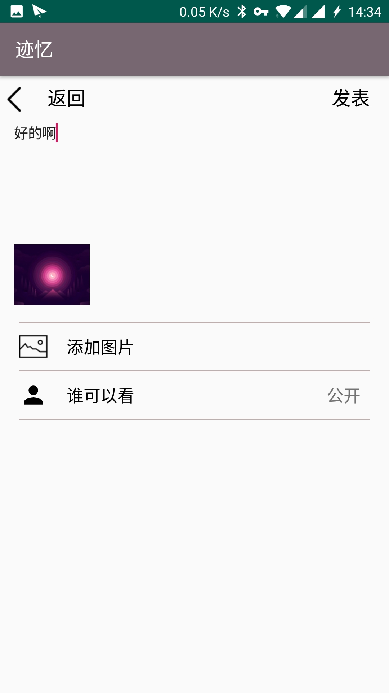
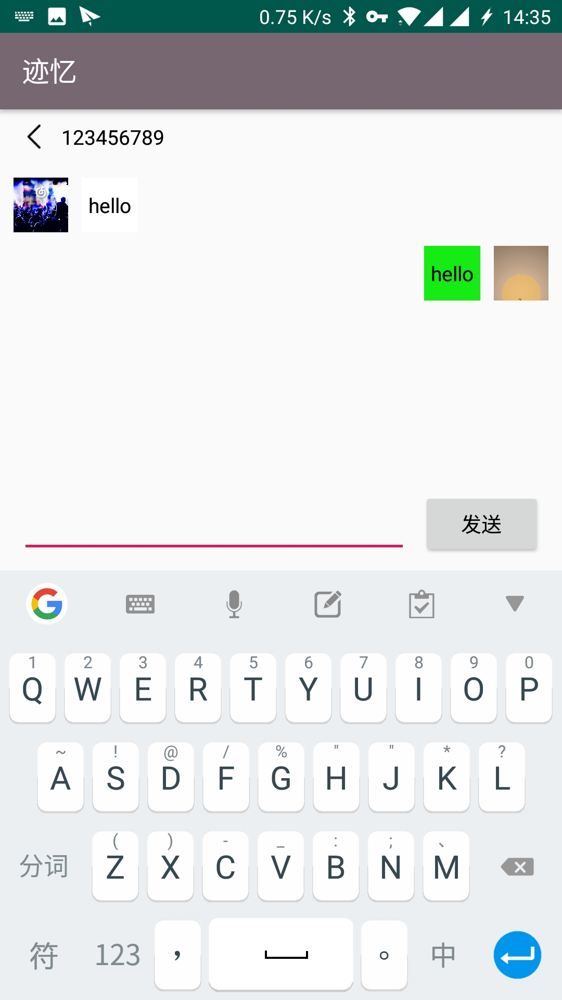

# 中山大学数据科学与计算机学院本科生实验报告
## （2018年秋季学期）
| 课程名称 |  手机平台应用开发   |  任课老师  |       郑贵锋       |
| :--: | :---------: | :----: | :-------------: |
|  年级  |    2016级    | 专业（方向） |     数字媒体方向      |
|  学号  |  16340294   |   姓名   |       张星        |
|  电话  | 15989001410 | Email  | dukestar@qq.com |
| 开始日期 | 2018.12.02  |  完成日期  |   2019.01.19    |


## 一、实验题目

## 迹忆
---

## 二、实现内容

1. 迹忆卡片编辑页面
2. 聊天框对话界面
---

## 三、课后实验结果

1. 迹忆卡片编辑页面：类似于朋友圈编辑页面，点击添加图片可以访问本机图库，点击权限设置可设为私人（仅自己可见）或者公开（所有人可见），点击发布即可在地图上发布迹忆卡片。



2. 聊天框对话界面：用户可点击广场上的迹忆卡片发布者的头像，发起对话。之后对话框就会出现在对话双方的私信界面，并且再次登陆数据并不会消失。



## 四、关键代码
* 迹忆卡片编辑页面：主要使用了TextView和ImageView，其中选择图片界面，使用了一个隐藏的ImageView，用户点击选择图片并选中后，该ImageView设为用户所选图片并加以显示。如下为编辑页面主体部分：
```xml
<LinearLayout
    android:id="@+id/edit"
    app:layout_constraintTop_toBottomOf="@id/back"
    android:orientation="vertical"
    android:layout_width="match_parent"
    android:layout_marginTop="10dp"
    android:layout_marginLeft="15dp"
    android:layout_marginRight="15dp"
    android:layout_height="200dp">
    <EditText
        android:id="@+id/content"
        android:layout_width="match_parent"
        android:layout_height="match_parent"
        android:layout_weight="1"
        android:gravity="start"
        android:background="@null"
        android:textSize="15dp"
        android:hint="说点什么..."
        app:layout_constraintLeft_toLeftOf="parent"
        app:layout_constraintRight_toRightOf="parent" />
    <ImageView
        android:id="@+id/image"
        android:visibility="gone"
        android:layout_weight="0"
        android:layout_width="80dp"
        android:layout_height="80dp" />
</LinearLayout>
```
* 选择图片：使用了之前的代码：
```java
pickImage.setOnClickListener(new View.OnClickListener() {
    @Override
    public void onClick(View v) {
        load(v);
    }
});

public void load(View view) {
    Intent intent = new Intent();
    intent.setAction(Intent.ACTION_PICK);
    intent.setType("image/*");
    startActivityForResult(intent, 0);
}

@Override
protected void onActivityResult(int requestCode, int resultCode, Intent data) {
    if (data != null) {
        Uri uri = data.getData();
        Bitmap original = null;

        String[] filePathColumns = {MediaStore.Images.Media.DATA};
        Cursor c = getContentResolver().query(uri, filePathColumns, null, null, null);
        c.moveToFirst();
        int columnIndex = c.getColumnIndex(filePathColumns[0]);
        String imagePath = c.getString(columnIndex);
        c.close();

        // 设置参数
        BitmapFactory.Options options = new BitmapFactory.Options();
        options.inJustDecodeBounds = true; // 只获取图片的大小信息，而不是将整张图片载入在内存中，避免内存溢出
        BitmapFactory.decodeFile(imagePath, options);
        int height = options.outHeight;
        int width= options.outWidth;
        int inSampleSize = 2; // 默认像素压缩比例，压缩为原图的1/2
        int minLen = Math.min(height, width); // 原图的最小边长
        if(minLen > 80) { // 如果原始图像的最小边长大于100dp
            float ratio = (float)minLen / 80.0f; // 计算像素压缩比例
            inSampleSize = (int)ratio;
        }
        options.inJustDecodeBounds = false; // 计算好压缩比例后，这次可以去加载原图了
        options.inSampleSize = inSampleSize; // 设置为刚才计算的压缩比例
        Bitmap bm = BitmapFactory.decodeFile(imagePath, options); // 解码文件
        image.setVisibility(View.VISIBLE);
        image.setScaleType(ImageView.ScaleType.FIT_CENTER);
        image.setImageBitmap(bm);
        ByteArrayOutputStream baos = new ByteArrayOutputStream();
        bm.compress(Bitmap.CompressFormat.PNG, 100, baos);
        byte[] bytes=baos.toByteArray();
        card.setCoverBitmapBytes(bytes);
    }
    super.onActivityResult(requestCode, resultCode, data);
}
```
* 点击人头图标切换权限：
```java
person.setOnClickListener(new View.OnClickListener() {
    @Override
    public void onClick(View v) {
        AlertDialog.Builder alertDialog = new AlertDialog.Builder(DetailActivity.this);
        String str = pickPermission.getText().toString();
        final String permission;
        if(str.equals("公开")){
            permission = "私人";
        }
        else {
            permission = "公开";
        }
        alertDialog.setTitle("权限设置").setMessage("确定更改为"+permission+"吗？").setPositiveButton("确认",
                new DialogInterface.OnClickListener() {
                    @Override
                    public void onClick(DialogInterface dialog, int which) {
                        pickPermission.setText(permission);
                        if(permission.equals("公开")){
                            card.setPrivate(false);
                        }else{
                            card.setPrivate(true);
                        }
                    }
                }).setNegativeButton("取消",
                new DialogInterface.OnClickListener() {
                    @Override
                    public void onClick(DialogInterface dialog, int which) {

                    }
                });
        alertDialog.show();
    }
});
```
* 点击返回图标则放弃此次编辑，点击发表则代表编辑成功：
```java
back.setOnClickListener(new View.OnClickListener() {
    @Override
    public void onClick(View v) {
        Intent intent = new Intent();
        setResult(0, intent);
        finish();
    }
});
submit.setOnClickListener(new View.OnClickListener() {
    @Override
    public void onClick(View v) {
        //to be continued
        card.setContent(content.getText().toString());
        card.setId((int) myDB.insertCard(card));
        Intent intent = new Intent();
        intent.putExtra("card",card);
        setResult(1, intent);
        finish();
    }
});
```
* 对话框界面：聊天记录使用了RecyclerView，上方除了一个退出图标，还有一个TextView，设为对话方的ID。布局文件如下：
```xml
<TextView
    android:layout_width="wrap_content"
    android:layout_height="wrap_content"
    android:id="@+id/conversation_receiver"
    android:text="Pony"
    android:textColor="@color/Dark"
    android:textSize="15dp"
    app:layout_constraintLeft_toRightOf="@+id/conversation_back"
    android:layout_marginLeft="10dp"
    app:layout_constraintTop_toTopOf="parent"
    android:layout_marginTop="10dp"/>

<android.support.v7.widget.RecyclerView
    android:id="@+id/conversation_message"
    android:layout_width="match_parent"
    android:layout_height="0dp"
    android:layout_marginTop="10dp"
    app:layout_constraintTop_toBottomOf="@+id/conversation_receiver"
    app:layout_constraintBottom_toTopOf="@+id/conversation_send"
    >

</android.support.v7.widget.RecyclerView>
```
* 每一条消息的布局，由于有对话方有两个，所以要区别对方和自己，聊天内容的显示应当有所区别：对方在左，己方在右。于是我在RecyclerView的Item中设置了两个布局，一个用于显示对方聊天内容，一个用于显示己方内容，每条聊天内容只能出现一方。
```xml
<android.support.constraint.ConstraintLayout
    android:id="@+id/message_fromSender"
    android:layout_width="match_parent"
    android:layout_height="match_parent">

    <ImageView
        android:id="@+id/message_sender1"
        app:layout_constraintTop_toTopOf="parent"
        app:layout_constraintRight_toRightOf="parent"
        android:layout_marginRight="10dp"
        android:layout_marginTop="10dp"
        android:src="@drawable/demo"
        android:layout_width="40dp"
        android:layout_height="40dp" />
    <TextView
        android:id="@+id/message_content1"
        android:layout_width="wrap_content"
        android:layout_height="wrap_content"
        android:padding="5dp"
        android:maxWidth="150dp"
        android:minHeight="40dp"
        android:gravity="center_vertical"
        app:layout_constraintRight_toLeftOf="@+id/message_sender1"
        android:layout_marginRight="10dp"
        app:layout_constraintTop_toTopOf="parent"
        android:layout_marginTop="10dp"
        android:background="@color/Green"
        android:textSize="15dp"
        android:textColor="@color/Dark"
        android:text="姐姐说几点就几点"/>

</android.support.constraint.ConstraintLayout>

<android.support.constraint.ConstraintLayout
    android:layout_width="match_parent"
    android:layout_height="match_parent"
    android:visibility="gone"
    android:id="@+id/message_fromReceiver">

    <ImageView
        android:id="@+id/message_sender2"
        app:layout_constraintTop_toTopOf="parent"
        app:layout_constraintLeft_toLeftOf="parent"
        android:layout_marginLeft="10dp"
        android:layout_marginTop="10dp"
        android:src="@drawable/demo"
        android:layout_width="40dp"
        android:layout_height="40dp" />
    <TextView
        android:id="@+id/message_content2"
        android:layout_width="wrap_content"
        android:layout_height="wrap_content"
        android:padding="5dp"
        android:maxWidth="150dp"
        android:minHeight="40dp"
        android:gravity="center_vertical"
        app:layout_constraintLeft_toRightOf="@+id/message_sender2"
        android:layout_marginLeft="10dp"
        app:layout_constraintTop_toTopOf="parent"
        android:layout_marginTop="10dp"
        android:background="@color/white"
        android:textSize="15dp"
        android:textColor="@color/Dark"
        android:text="姐姐说几点就几点"/>

</android.support.constraint.ConstraintLayout>
```
* 要实现对话显示，首先需要新建一个Message的类，用于记录每一条对话对应的发送方、接收方、聊天内容和发送时间，用于后续显示设置：
```java
public class Message implements Serializable {
    private String sender;
    private String receiver;
    private String message;
    private Date time;
    public Message(){
        sender = null;
        receiver = null;
        message = null;
        time = null;
    }
}
```
* 当从广场点击对方图标时，进入对话框界面，此时Activity向ConversationActivity发送了一个Intent，包含两个对话方ID，默认第一个为发送方，第二个为接收方。
```java
List<String> users = (List<String>) this.getIntent().getSerializableExtra("users");
sender = users.get(0);
receiver = users.get(1);
```
* 访问数据库，获取对话双方的头像：
```java
db = new MyDatabase(getApplication());
byte[] cover1, cover2;
cover1 = db.getCover(sender);
cover2 = db.getCover(receiver);
if(cover1==null||cover2==null){
    Toast.makeText(getApplicationContext(),"User doesn't exist.",Toast.LENGTH_SHORT).show();
    finish();
}
else{
    senderPhoto = BitmapFactory.decodeByteArray(cover1, 0, cover1.length);
    receiverPhoto = BitmapFactory.decodeByteArray(cover2,0,cover2.length);
}
```
* 从数据库中先加载双方的聊天记录，若存在。
```java
public void getRecord(){
    List<Message> temp = db.queryConversation(sender,receiver);
    if(temp!=null){
        for(int i = 0;i < temp.size();i++ ){
            messages.add(temp.get(i));
        }
    }
    int length = messages.size()-1;
    if(length>-1){
        lastMsg = messages.get(length);
    }
    else{
        lastMsg = null;
    }
    myAdapter.notifyDataSetChanged();
}
```
* 加载对话时，根据发送方的不同，选择不同的布局：
```java
if(m.getSender().equals(sender)){
    ImageView photo = holder.getView(R.id.message_sender1);
    TextView content = holder.getView(R.id.message_content1);
    content.setText(m.getMessage());
    photo.setImageBitmap(senderPhoto);
}else{
    ConstraintLayout constraintLayout1 = holder.getView(R.id.message_fromSender);
    ConstraintLayout constraintLayout2 = holder.getView(R.id.message_fromReceiver);
    constraintLayout1.setVisibility(View.GONE);
    constraintLayout2.setVisibility(View.VISIBLE);
    ImageView photo = holder.getView(R.id.message_sender2);
    TextView content = holder.getView(R.id.message_content2);
    content.setText(m.getMessage());
    photo.setImageBitmap(receiverPhoto);
}
```
* 按下返回键时，返回最后一条消息，用于配合更新最后一条的消息记录，在私信页面会有体现。
```java
public void onBackPressed() {
    super.onBackPressed();
    Intent intent = new Intent();
    intent.putExtra("lastMsg", (Serializable) lastMsg);
    setResult(1, intent);
    finish();
}
```
---

## 五、实验难点及解决方案
* 当渲染消息时，无法区分发送方和接收方。</br>
  解决方法：在布局文件中区分发送方和接收方，从而设置显示/隐藏，达到目的。
* 从上一界面跳转时，无法确认接收双方。</br>
  解决方法：在上一界面传递两个字符串，默认第一个为发送方，第二个为接收方，当其中任何一方不存在时，跳转失败并提醒。
* 当页面消息更新后，私信页面需要对应更新，无法获取更新。</br>
  解决方法：一开始我的想法是从数据库中，根据对话双方获取消息，然后更新最后一条，但是这样做明显代价过大，所以我使用了Intent，将最后一条message返回，这样就可以达到更新的效果。

---

## 六、实验思考及感想
本次项目主要用了高德地图的API，实现了许多内容。剩余的部分都是基于老师上课所讲内容。但在实现聊天框时，依然出现了很多问题，我没有想到一个简单的聊天框也有这么多的小点会出bug。经过查询资料，自己动手摸索之后得以解决。相对于期中项目，本次期末项目无论是从工作量，还是知识点覆盖范围，还是难度等等方面，都提升了很多，所以做起来并不轻松。但由于我们分工明确，并且各个部分的进度能够相互协调，实时跟进，为我们省了很多力气，使得能够集中精力放在重点难点，加快了项目的进度。整个项目完成之后，我感觉不仅对于本课程所教授内容更加了解，也接触到了很多课上没有涉及的新知识，扩展了对于安卓开发的理解。

---

## 七、个人贡献评分

95
